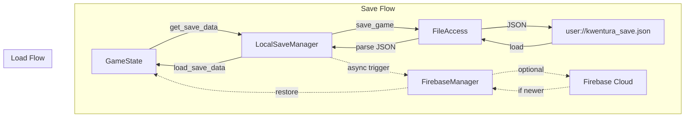
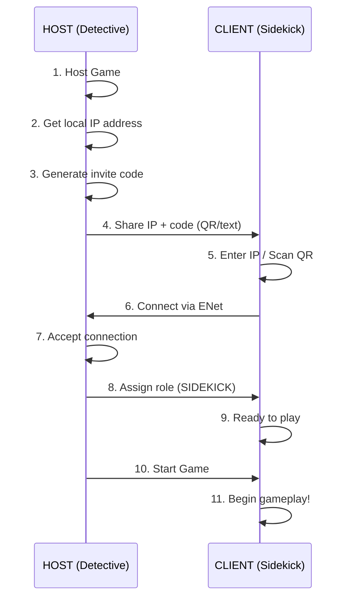
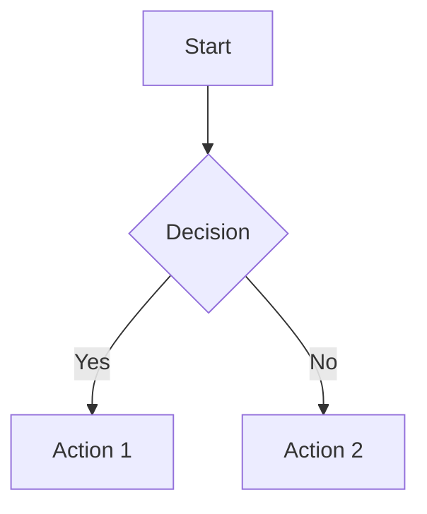
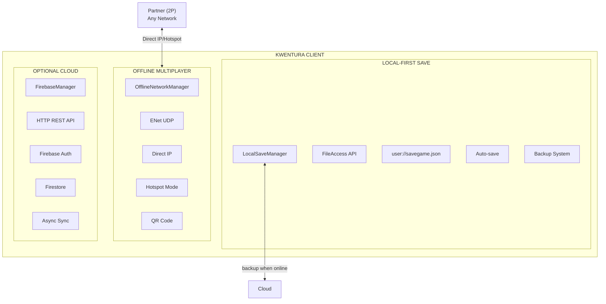
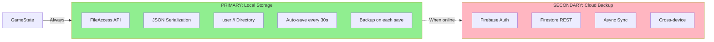
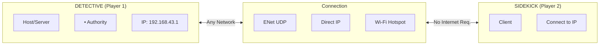

# Kwentura - AI Agent Documentation

## Project Overview

**Kwentura** is a 2D detective mobile game built with Godot 4.5 featuring 2-player cooperative multiplayer. Players take on asymmetric roles:
- **Detective (Host)**: Visual gameplay, explores environments, finds clues
- **Sidekick**: Audio-based navigation, assists the detective through sound cues

The game follows a Philippine folklore-inspired narrative where players investigate the mystery of "Pina" across multiple zones, collecting clues to unlock the climax sequence.

## Technology Stack

### Client (Game)
- **Engine**: Godot 4.5 (Forward Plus renderer)
- **Language**: GDScript
- **Resolution**: 1920x1080 (canvas_items stretch mode)
- **Platform**: Mobile-first 2D game
- **Multiplayer**: Built-in ENetMultiplayerPeer (Direct IP / Hotspot)
- **Local Save**: FileAccess API (JSON in user://)
- **Cloud Save**: Firebase REST API (optional, for cross-device sync)

### Local Save (Primary)
- **Method**: FileAccess API with JSON serialization
- **Location**: `user://kwentura_save.json` (platform-specific)
- **Features**: Auto-save, backup system, corruption recovery
- **Requirement**: None - works 100% offline

### Cloud Save (Optional)
- **Service**: Firebase (Firestore + Anonymous Auth)
- **Integration**: Direct REST API via HTTPRequest node
- **Purpose**: Cross-device save sync, progress backup
- **Note**: Works independently of multiplayer - pure client-side cloud storage

### Server
- **Architecture**: No dedicated server required
- **Model**: Listen Server (peer-hosted)
- **Network**: UDP (ENet) for game data
- **Connection**: Direct IP or Hotspot mode (no same Wi-Fi required)
- **Authentication**: None required for LAN play

## Project Structure

```
Kwentura/
├── kwentura/                   # Godot game project
│   ├── project.godot          # Godot project configuration
│   ├── scripts/               # GDScript source files
│   │   ├── systems/           # Core systems (autoloaded)
│   │   │   ├── firebase_auth.gd          # (Optional) Anonymous auth
│   │   │   ├── firebase_firestore.gd     # (Optional) Cloud save operations
│   │   │   ├── firebase_manager.gd       # Cloud backup coordinator
│   │   │   ├── local_save_manager.gd     # PRIMARY save system
│   │   │   ├── offline_network_manager.gd # Multiplayer (direct IP/hotspot)
│   │   │   ├── network_manager_compat.gd  # Backward compatibility wrapper
│   │   │   ├── game_state.gd             # Game progression state
│   │   │   └── puzzle_manager.gd         # Puzzle system
│   │   ├── mainMenu/          # Menu scenes logic
│   │   ├── players/           # Player controllers
│   │   ├── world/             # Game world scripts
│   │   │   ├── zones/         # Zone-specific logic
│   │   │   └── climax/        # End-game sequences
│   │   ├── puzzles/           # Puzzle implementations
│   │   └── cutscenes/         # Cutscene scripts
│   ├── scenes/                # Godot scene files (.tscn)
│   │   ├── mainMenu/          # Menu scenes
│   │   ├── players/           # Player scene files
│   │   ├── world/             # World scenes
│   │   └── ui/                # UI components
│   └── assets/                # Game assets
│       ├── sprites/
│       ├── audio/
│       ├── backgrounds/
│       ├── buttons/
│       └── fonts/
└── README.md
```

## Autoloaded Singletons (Godot)

The following nodes are autoloaded in `project.godot`:

| Singleton | Purpose | Optional | Notes |
|-----------|---------|----------|-------|
| `LocalSaveManager` | PRIMARY save/load system | ❌ No | Always works offline |
| `FirebaseAuth` | Anonymous Firebase authentication | ✅ Yes | For cloud backup only |
| `FirebaseManager` | Cloud backup coordinator | ✅ Yes | Syncs local saves to cloud |
| `FirebaseFirestore` | Firestore database operations | ✅ Yes | Called by FirebaseManager |
| `GameState` | Game progression, clues, zones | ❌ No | Uses LocalSaveManager |
| `NetworkManager` | Multiplayer networking | ❌ No | Now uses OfflineNetworkManager |
| `PuzzleManager` | Puzzle state management | ❌ No | |

**Important Notes**:
- `LocalSaveManager` is the **primary** save system - always works offline
- `FirebaseManager` is **secondary** - only for cloud backup when online
- `NetworkManager` now points to `OfflineNetworkManager` - supports direct IP and hotspot modes
- All Firebase singletons gracefully fail without internet

## Save System Architecture (Local-First)



### Save Data Flow

1. **Save** (on clue collected, zone completed, etc.):
   ```gdscript
   # In GameState.collect_clue():
   LocalSaveManager.save_game(get_save_data())  # Always works
   FirebaseManager.sync_to_cloud()              # Optional, non-blocking
   ```

2. **Load** (on game start):
   ```gdscript
   # In GameState._ready():
   var data = LocalSaveManager.load_game()  # Primary source
   if data.size() > 0:
       load_save_data(data)
   else:
       FirebaseManager.restore_from_cloud()  # Fallback
   ```

### Save File Location by Platform

| Platform | Save Location |
|----------|---------------|
| Android | `/data/data/[package]/files/kwentura_save.json` |
| iOS | `Documents/kwentura_save.json` |
| Windows | `%APPDATA%/Godot/app_userdata/Kwentura/kwentura_save.json` |
| Mac/Linux | `~/.local/share/godot/app_userdata/Kwentura/kwentura_save.json` |

## Build and Run Commands

### Prerequisites
- Godot 4.5+ (for client)
- No server setup required!

### Running the Game

1. Open `kwentura/project.godot` in Godot 4.5+ editor
2. Press F5 (Play) to run
3. For multiplayer testing:
   - **Player 1**: Click "Host Game" (becomes Detective)
   - **Player 2**: Click "Join Game" and enter host's IP address

## Offline Multiplayer Setup

### Connection Methods

The game supports **three** connection modes:

#### 1. Direct IP (Same Wi-Fi)
- Host shares their local IP (e.g., `192.168.1.5`)
- Client enters IP and connects directly
- Works on any local network

#### 2. Hotspot Mode (No Wi-Fi Router)
- **Host**: Enable mobile hotspot in phone settings
- **Client**: Connect to host's Wi-Fi hotspot
- **Both**: Use the hotspot IP range (Android: `192.168.43.x`, iOS: `172.20.10.x`)

#### 3. QR Code (Quick Connect)
- Host displays QR code containing IP + port + room code
- Client scans QR code to auto-connect

### Connection Flow



### Host Instructions

```
📱 HOST (Detective)

Your IP: 192.168.43.1
Room Code: ABC123

Share with partner:
• Same Wi-Fi: Give them your IP
• Hotspot Mode: Enable hotspot, share password
• QR Code: Show them the QR code
```

### Client Instructions

```
📱 CLIENT (Sidekick)

Enter Host IP: [____________]

Connection Options:
🛜 Same Wi-Fi: Ask for IP (e.g., 192.168.1.5)
📶 Hotspot: Connect to host's hotspot first
📷 QR Code: Scan host's QR code

Troubleshooting:
• Ensure same network/hotspot
• Try disabling mobile data
• Verify IP is correct
```

## Code Style Guidelines

### GDScript (Godot Client)
- Use **snake_case** for variables, functions, and file names
- Use **PascalCase** for class names and node names
- Use **UPPER_SNAKE_CASE** for constants and enums
- Indent with tabs (Godot convention)
- Signal names use **snake_case**
- Private methods prefixed with underscore: `_private_method()`
- Type hints encouraged: `func my_func(param: String) -> int:`
- Comments use `#` with space after
- Class documentation comments use `##` (Godot 4.x style)

Example:
```gdscript
## Brief description of what this does
func _process(delta: float) -> void:
    var local_position: Vector2 = global_position - _parent_position
    _velocity.x = lerp(_velocity.x, 0.0, FRICTION * delta)
```

## Documentation Guidelines

### Using Mermaid Diagrams

When creating documentation (plans, architecture docs, flow charts), use **Mermaid diagrams** instead of ASCII art for better readability and maintainability:

```markdown

```

**Common diagram types:**
- `flowchart TD/LR` - Flowcharts for processes and architectures
- `sequenceDiagram` - For interaction/connection flows
- `classDiagram` - For class hierarchies
- `stateDiagram` - For state machines

## Key Architecture Concepts

### Three-System Architecture

Kwentura uses **three independent systems**:



### Local-First Save System



**Key Points**:
- Local save is **primary** - always works offline
- Cloud save is **backup only** - optional, non-blocking
- Auto-save triggers on progress events
- Backup system prevents save corruption

### Network Architecture: Offline Multiplayer



**Connection Modes:**
1. **Direct IP**: Enter IP address directly
2. **Hotspot**: Host creates Wi-Fi hotspot
3. **QR Code**: Scan to auto-connect

**Benefits:**
- ✅ No Wi-Fi router required
- ✅ Works entirely offline
- ✅ No internet connection needed
- ✅ Low latency direct connection
- ✅ Simple to set up anywhere

### Game State Structure

```gdscript
# Core progression tracking
var current_zone: String = "forest_hub"
var zones_status: Dictionary = {
    "pinas_house": ZoneStatus.AVAILABLE,
    "backyard_path": ZoneStatus.AVAILABLE,
    "old_well": ZoneStatus.AVAILABLE,
    "storage_hut": ZoneStatus.AVAILABLE,
    "abandoned_house": ZoneStatus.AVAILABLE
}

# Clues system
var collected_clues: Dictionary = {
    "pinas_house": {
        "collected": false,
        "item": "Ladle",
        "text": "We use our eyes to find things..."
    },
    # ... more clues
}
```

### RPC (Remote Procedure Call) Usage

Key RPC functions for multiplayer sync:

```gdscript
# Host → Client: Assign role after connection
@rpc("authority", "reliable")
func _assign_role_rpc(role: Role, invite_code: String, session_seed: int)

# Host → Client: Start game
@rpc("authority", "reliable")
func _game_started_rpc(checkpoint: String)

# Client → Host: Submit puzzle solution
@rpc("any_peer", "reliable")
func submit_puzzle_solution(puzzle_id: String, solution: Variant, attempt_time_ms: int)

# Bidirectional: Sync player position (unreliable for speed)
@rpc("any_peer", "unreliable_ordered")
func sync_player_state(position: Vector2, velocity: Vector2, facing: String, animation_state: String)
```

## Testing

### Manual Testing Checklist

#### Save System
- [ ] Game saves to local file on clue collection
- [ ] Game loads from local file on startup
- [ ] Auto-save triggers every 30 seconds
- [ ] Backup files created on each save
- [ ] Corrupted save restores from backup
- [ ] Cloud sync works when online (optional)

#### Multiplayer
- [ ] Host displays IP address and QR code
- [ ] Client can connect via direct IP (same Wi-Fi)
- [ ] Client can connect via hotspot mode
- [ ] QR code scanning auto-connects
- [ ] Game starts when host clicks "Start"
- [ ] Player movement syncs between clients
- [ ] Puzzle attempts validate correctly (host authority)
- [ ] Clue collection syncs to both players
- [ ] Disconnect handling works (pause game)

### Testing Multiplayer Locally

To test on a single computer:
1. Export the game as executable
2. Run one instance from Godot editor (Host)
3. Run second instance from exported executable (Join)
4. Use "127.0.0.1" as IP to connect to yourself

### Testing Save System

```gdscript
# Test local save
LocalSaveManager.save_game(GameState.get_save_data())
var data = LocalSaveManager.load_game()
print("Save test: ", data.size() > 0)

# Test cloud sync (requires internet)
FirebaseManager.sync_to_cloud()
```

## Security Considerations

### Offline-First Design
- Game works 100% without internet
- No external dependencies for core gameplay
- All sensitive data stored locally

### Host Authority
- All puzzle validation happens on host (Detective)
- Clients cannot cheat by modifying game state
- Host state is the "source of truth"

### Save File Security
- Save files stored in platform-protected user directories
- JSON format allows for easy backup/restore
- Backup system prevents data loss

## Deployment Notes

### Godot Export
- Export presets configured in `export_presets.cfg`
- Mobile-focused (portrait/landscape depending on scene)
- ENet multiplayer works on all platforms (Windows, Mac, Linux, Android, iOS)

### Network Requirements
**For Offline Multiplayer**:
- No internet connection required
- Works with mobile hotspots
- Port 17777 (UDP) used for game data
- Most devices allow this by default

**For Cloud Save (Optional)**:
- Internet connection
- Firebase project configured

## Common Development Tasks

### Adding a New Zone
1. Create scene in `scenes/world/zones/`
2. Add zone script in `scripts/world/zones/`
3. Update `GameState.zones_status` with new zone
4. Add clue entry in `GameState.collected_clues`

### Adding a Puzzle
1. Create puzzle scene in `scenes/puzzles/`
2. Implement logic in `scripts/puzzles/`
3. Connect to `PuzzleManager` for state tracking
4. Call `NetworkManager.submit_puzzle()` for validation (host authority)

### Debugging Network Issues
Enable verbose logging in OfflineNetworkManager:
```gdscript
# In offline_network_manager.gd
print("[OfflineNetwork] Debug: ", variable)
```

### Debugging Save Issues
```gdscript
# Check save file location
print("Save path: ", LocalSaveManager.SAVE_FILE_NAME)

# Check save info
print("Save info: ", LocalSaveManager.get_save_info())
```

## File Naming Conventions

- GDScript: `snake_case.gd`
- Scene files: `PascalCase.tscn`
- Assets: descriptive with suffix (e.g., `button_start.png`)
- Documentation: `UPPERCASE.md` for important docs
- Plans: Create in `docs/plans/` with descriptive names

## Dependencies

### Godot Project
- **Core**: No external dependencies - uses built-in Godot 4.5 only
- **Local Save**: FileAccess API (built-in)
- **Multiplayer**: ENetMultiplayerPeer (built-in)
- **Cloud Save**: Firebase REST API via HTTPRequest (built-in, optional)

### Firebase Setup (Optional)
If you want cloud save functionality:
1. Create Firebase project at https://console.firebase.google.com
2. Enable Firestore Database and Anonymous Authentication
3. Replace `API_KEY` and `PROJECT_ID` in:
   - `firebase_auth.gd`
   - `firebase_manager.gd`
   - `firebase_firestore.gd`
4. Set up Firestore security rules for anonymous users

### Network Requirements
**For Offline Multiplayer**:
- Two devices (host + client)
- Direct IP connection OR shared hotspot
- Port 17777 (UDP) available

**For Cloud Save (Optional)**:
- Internet connection
- Firebase project configured

## UI Patterns

### Settings Panel Pattern

All menu scenes use a consistent settings panel structure:

#### Scene Structure

```
Control (root)
├── Main UI Buttons (Host/Join/Exit or Start/Back or Cancel)
├── SettingsControl (CanvasLayer with settings button)
└── SettingsPanel (Panel - hidden by default)
    ├── Back (TouchScreenButton) - closes settings
    ├── ViewUserProfile (Button) - opens user profile
    ├── VolumeSliderControl
    └── UserProfile (Panel - hidden by default)
        ├── BackToPrevious (TouchScreenButton) - back to settings
        ├── UserContent (Avatar, DisplayName, ProviderLabel)
        └── AuthButtons (SignIn, Guest, LinkGoogle)
```

#### Button Visibility Pattern

Only hide buttons that could interfere with the settings panel. Keep other UI visible for context.

```gdscript
# Node references
@onready var settings_control: CanvasLayer = $SettingsControl
@onready var settings_panel: Panel = $SettingsPanel
@onready var back_button: Button = %BackButton  # or cancel_button, etc.

# Toggle only the buttons that need to be hidden
func _set_main_buttons_visible(visible: bool) -> void:
    if back_button:
        back_button.visible = visible

# Open settings - hide relevant buttons
func _on_settings_pressed() -> void:
    settings_panel.visible = true
    _set_main_buttons_visible(false)      # Hide main buttons
    settings_control.hide_button()        # Hide settings button itself
    if user_profile_panel:
        user_profile_panel.visible = false
    if view_user_profile_button:
        view_user_profile_button.visible = true

# Close settings - restore buttons  
func _on_back_settings_pressed() -> void:
    settings_panel.visible = false
    if user_profile_panel:
        user_profile_panel.visible = false
    _set_main_buttons_visible(true)       # Show main buttons
    settings_control.show_button()        # Show settings button
    _save_settings()
```

**Per-Scene Configuration:**

| Scene | Buttons Hidden | Notes |
|-------|---------------|-------|
| MainMenu | Host, Join, Exit | All main menu buttons |
| DetectiveLobby | Back only | Start, room code, costumes remain visible |
| SidekickWaiting | Cancel only | Status, costumes remain visible |

#### User Profile Navigation

```gdscript
@onready var view_user_profile_button: Button = $SettingsPanel/ViewUserProfile
@onready var user_profile_panel: Panel = $SettingsPanel/UserProfile
@onready var user_profile_back_button: TouchScreenButton = $SettingsPanel/UserProfile/BackToPrevious

# Navigate to user profile
func _on_view_user_profile_pressed() -> void:
    user_profile_panel.visible = true
    view_user_profile_button.visible = false

# Return to settings
func _on_back_from_profile_pressed() -> void:
    user_profile_panel.visible = false
    view_user_profile_button.visible = true
```

**Navigation Flow:**
1. User clicks Settings → SettingsPanel opens
2. User clicks "View User Profile" → UserProfile panel shows
3. User clicks back arrow → Returns to SettingsPanel
4. User clicks X → Returns to main menu

#### Reusable Base Class

For new scenes, you can use `SettingsPanelBase` (`scripts/controls/settings_panel_base.gd`) as a reference or extend it:

```gdscript
extends SettingsPanelBase

func _ready():
    # Set up node references
    settings_control = $SettingsControl
    settings_panel = $SettingsPanel
    # ... other nodes
    
    # Set which buttons to hide
    set_main_ui_buttons([back_button])
    
    # Connect all signals
    setup_settings_signals()
```

See `main_menu.gd` for the implementation:
- `_on_view_user_profile_pressed()` - Opens user profile
- `_on_back_from_profile_pressed()` - Returns to settings
