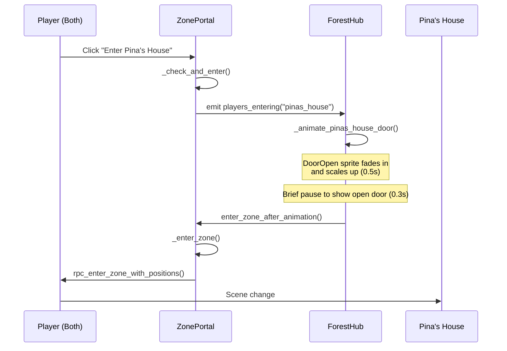

# Door Opening Transition Implementation

## Overview

Implemented an animated door opening transition for entering Pina's House. Instead of an instant gray screen transition, the house door now animates open before the scene changes.

## How It Works

```
Player clicks "Enter" button
        ↓
ZonePortal emits "players_entering" signal
        ↓
ForestHub plays door opening animation (0.5s + 0.3s pause)
        ↓
After animation completes → Scene changes to Pina's House
```

## Flow Diagram



## Files Modified

### 1. zone_portal.gd

**Changes:**
- Modified `_check_and_enter()` to only emit `players_entering` signal (removed direct `_enter_zone()` call)
- Added new function `enter_zone_after_animation()` that gets called after animation completes
- Scene change now happens AFTER door animation, not before

```gdscript
# OLD: Immediately entered zone
players_entering.emit(zone_name)
_enter_zone()

# NEW: Only emit signal, wait for animation
players_entering.emit(zone_name)
# _enter_zone() is called by ForestHub after animation
```

### 2. forest_hub.gd

**Changes:**
- Modified `_on_players_entering_zone()` to `await` the door animation
- Added `_find_portal_by_zone_name()` helper function
- Added `_animate_pinas_house_door()` completion delay (0.3s)
- Animation sequence:
  1. DoorOpen sprite becomes visible
  2. Fades in from alpha 0 to 1
  3. Scales from 0.1 to 1.0
  4. Brief pause to show open door
  5. Triggers actual zone entry

## Animation Details

### DoorOpen Sprite
- **Location:** `Zone Portals/PortalPinasHouse/DoorOpen`
- **Initial State:** `visible = false`
- **Animation Duration:** 0.5 seconds
- **Pause After:** 0.3 seconds
- **Easing:** Tween.TRANS_BACK, Tween.EASE_OUT

### Visual Effect
1. DoorOpen sprite appears in front of closed door
2. Scales up from small to full size
3. Fades in smoothly
4. Brief pause lets players see the open door
5. Scene transitions to Pina's House interior

## Configuration

### Timing Constants (forest_hub.gd)

```gdscript
const DOOR_ANIMATION_DURATION: float = 0.5  # Door open animation
# Plus 0.3s pause hardcoded in _animate_pinas_house_door()
```

### To Adjust Timing

Edit `kuwentura/scripts/world/hub/forest_hub.gd`:

```gdscript
# Change this value for faster/slower door animation
const DOOR_ANIMATION_DURATION: float = 0.5

# Change this for longer/shorter pause after animation
await get_tree().create_timer(0.3).timeout
```

## Extending to Other Zones

To add door animations for other zones (Old Well, Storage Hut, etc.):

1. **Add door sprite to scene:**
   ```
   ForestHub.tscn
   └── Zone Portals
       └── Portal[ZoneName]
           └── DoorOpen (Sprite2D, initially hidden)
   ```

2. **Add reference in forest_hub.gd:**
   ```gdscript
   @onready var old_well_door: Sprite2D = $"Zone Portals/PortalOldWell/DoorOpen"
   ```

3. **Add animation function:**
   ```gdscript
   func _animate_old_well_door() -> void:
       # Similar to _animate_pinas_house_door()
   ```

4. **Update _on_players_entering_zone():**
   ```gdscript
   func _on_players_entering_zone(zone_name: String) -> void:
       match zone_name:
           "pinas_house":
               await _animate_pinas_house_door()
           "old_well":
               await _animate_old_well_door()
           # etc...
       
       var portal = _find_portal_by_zone_name(zone_name)
       if portal:
           portal.enter_zone_after_animation()
   ```

## Testing Checklist

- [ ] Both players approach Pina's House portal
- [ ] "Enter Pina's House" button appears
- [ ] Both players click Enter
- [ ] DoorOpen sprite animates (scales up + fades in)
- [ ] Brief pause shows open door
- [ ] Scene transitions to Pina's House interior
- [ ] Players spawn at correct positions
- [ ] No gray/fade transition visible

## Troubleshooting

### Door animation doesn't play
- Check `DoorOpen` sprite exists at path: `Zone Portals/PortalPinasHouse/DoorOpen`
- Check sprite has texture assigned
- Check `pinas_house_door` reference is correct in forest_hub.gd

### Scene changes too quickly
- Increase `DOOR_ANIMATION_DURATION` constant
- Increase the `create_timer()` delay

### Scene doesn't change after animation
- Check `_find_portal_by_zone_name()` returns correct portal
- Check `enter_zone_after_animation()` is being called
- Verify `_enter_zone()` isn't being blocked

## Related Files

- `kuwentura/scripts/world/hub/zone_portal.gd` - Portal logic and entry
- `kuwentura/scripts/world/hub/forest_hub.gd` - Door animation and hub management
- `kuwentura/scenes/world/hub/ForestHub.tscn` - Scene with DoorOpen sprite
- `kuwentura/scenes/world/zones/pinasHouse/PinasHouse.tscn` - Destination scene
