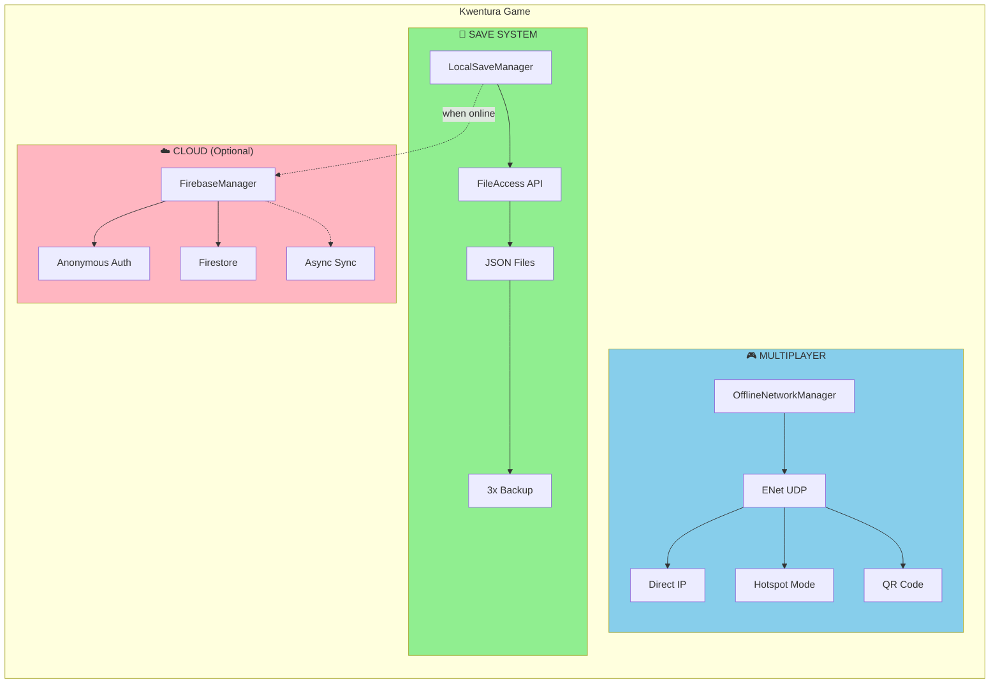

# Implementation Summary: Offline Multiplayer & Local-First Save

## Overview

This implementation transforms Kwentura into a **100% offline-capable** game with:
1. **Local-First Save System** - Primary storage on device (always works)
2. **Firebase Cloud Backup** - Optional cross-device sync (when online)
3. **True Offline Multiplayer** - Hotspot mode + Direct IP (no Wi-Fi router required)

---

## Files Created/Modified

### New Files Created

| File | Purpose |
|------|---------|
| `scripts/systems/local_save_manager.gd` | Primary save system using FileAccess |
| `scripts/systems/offline_network_manager.gd` | Multiplayer with direct IP/hotspot support |
| `scripts/systems/network_manager_compat.gd` | Backward compatibility wrapper |
| `docs/plans/OFFLINE_MULTIPLAYER_AND_LOCAL_SAVE_PLAN.md` | Detailed implementation plan |

### Files Modified

| File | Changes |
|------|---------|
| `scripts/systems/firebase_manager.gd` | Refactored to be cloud backup only |
| `scripts/systems/firebase_firestore.gd` | Added async methods and status checks |
| `scripts/systems/game_state.gd` | Now uses LocalSaveManager as primary |
| `project.godot` | Added LocalSaveManager autoload, updated NetworkManager |
| `AGENTS.md` | Updated architecture documentation |

---

## Key Features

### 1. Local-First Save System

```gdscript
# In GameState - always saves to local first
func collect_clue(zone_id: String) -> bool:
    # ... game logic ...
    
    # PRIMARY: Save to local (always works)
    LocalSaveManager.save_game(get_save_data())
    
    # SECONDARY: Cloud backup (optional, non-blocking)
    if FirebaseManager.is_cloud_available():
        FirebaseManager.sync_to_cloud()
```

**Features:**
- ✅ JSON-based save files in `user://kwentura_save.json`
- ✅ Automatic backup system (3 rotating backups)
- ✅ Auto-save on progress (clue collection, zone completion)
- ✅ Auto-save every 30 seconds during gameplay
- ✅ Corruption recovery from backup
- ✅ Play time tracking
- ✅ Cross-platform (Android, iOS, Windows, Mac, Linux)

### 2. Offline Multiplayer

```gdscript
# Host a game (any network configuration)
OfflineNetworkManager.host_game()
# Returns: IP, port, invite code, QR data

# Join via direct IP
OfflineNetworkManager.join_with_ip("192.168.43.1", "ABC123")

# Join via QR code
OfflineNetworkManager.join_with_qr("KWENTURA|192.168.43.1|17777|ABC123")
```

**Connection Modes:**
1. **Direct IP** - Enter IP address directly (same Wi-Fi)
2. **Hotspot Mode** - Host creates mobile hotspot, client connects
3. **QR Code** - Scan to auto-connect

**Hotspot IP Detection:**
- Android: `192.168.43.x` or `192.168.44.x`
- iOS: `172.20.10.x`
- Fallback: Any private network IP

### 3. Firebase as Cloud Backup

```gdscript
# Cloud sync is now OPTIONAL and NON-BLOCKING
# Game works 100% without internet

# Manual cloud operations
FirebaseManager.sync_to_cloud()           # Upload local save
FirebaseManager.restore_from_cloud()      # Download and merge
FirebaseManager.check_cloud_save()        # Check if cloud save exists
```

**Behavior:**
- Local save is always primary source of truth
- Cloud sync only happens when explicitly enabled and online
- Conflict resolution: Cloud wins if newer timestamp
- No blocking operations - game never waits for cloud

---

## Architecture Diagram



---

## Usage Examples

### Save System

```gdscript
# Check if save exists
if LocalSaveManager.has_save_file():
    var info = LocalSaveManager.get_save_info()
    print("Zones completed: ", info.zones_completed)
    print("Play time: ", LocalSaveManager.format_play_time(info.play_time))

# Manual save
LocalSaveManager.save_game()

# Load game
var data = LocalSaveManager.load_game()
GameState.load_save_data(data)

# Delete save (new game)
LocalSaveManager.delete_save()
```

### Multiplayer

```gdscript
# Host
func _on_host_pressed():
    var result = await OfflineNetworkManager.host_game()
    if result.success:
        ip_label.text = "Your IP: " + result.host_ip
        code_label.text = "Code: " + result.invite_code
        qr_texture.texture = generate_qr(result.qr_data)

# Join
func _on_join_pressed():
    var ip = ip_input.text
    var result = await OfflineNetworkManager.join_with_ip(ip)
    if result.success:
        show_waiting_screen()
    else:
        show_error(result.error)
```

### Cloud Backup

```gdscript
# Check cloud status
if FirebaseManager.is_cloud_available():
    var info = FirebaseManager.get_cloud_save_info()
    print("Cloud save exists: ", info.exists)
    print("Last sync: ", info.formatted_time)

# Manual sync
FirebaseManager.sync_to_cloud()

# Restore from cloud
FirebaseManager.restore_from_cloud()
```

---

## Save File Format

```json
{
    "collected_clues": {
        "pinas_house": {
            "collected": true,
            "item": "Ladle",
            "text": "We use our eyes to find things...",
            "zone_name": "Pina's House"
        }
    },
    "zones_status": {
        "pinas_house": 2,
        "backyard_path": 1
    },
    "current_zone": "forest_hub",
    "game_completed": false,
    "play_time_seconds": 3600,
    "_metadata": {
        "version": "1.0",
        "timestamp": 1700000000,
        "platform": "Android",
        "total_saves": 42
    }
}
```

---

## Testing Checklist

### Save System
- [ ] Start game, collect clue, verify save file created
- [ ] Restart game, verify progress loaded
- [ ] Check backup files created
- [ ] Test corruption recovery (modify JSON, verify backup restore)
- [ ] Verify auto-save triggers

### Multiplayer
- [ ] Host game, verify IP displayed
- [ ] Join via direct IP (same Wi-Fi)
- [ ] Test hotspot mode (Android)
- [ ] Test hotspot mode (iOS)
- [ ] Test QR code connection
- [ ] Verify game syncs correctly
- [ ] Test disconnect handling

### Cloud (Optional)
- [ ] Verify local save works without internet
- [ ] Enable internet, verify cloud sync
- [ ] Test restore from cloud
- [ ] Verify conflict resolution

---

## Migration Notes

### For Existing Code

The `NetworkManager` autoload now points to `OfflineNetworkManager`. The API is similar but improved:

```gdscript
# Old (still works via compat layer)
NetworkManager.host_game()
NetworkManager.join_game_with_code("ABC123")  # Deprecated

# New (recommended)
OfflineNetworkManager.host_game()
OfflineNetworkManager.join_with_ip("192.168.1.5")
OfflineNetworkManager.join_with_qr(qr_string)
```

### Save System Migration

Existing Firebase-only saves will be preserved. On first run with new system:
1. Game loads from cloud (if available and newer)
2. Saves to local storage
3. Future saves go to local first, then cloud

---

## Benefits

| Feature | Before | After |
|---------|--------|-------|
| Internet Required | Yes (for cloud save) | No (100% offline) |
| Same Wi-Fi Required | Yes | No (hotspot works) |
| Save Reliability | Depends on internet | Always works locally |
| Connection Method | Discovery only | Direct IP, Hotspot, QR |
| Cross-Device Sync | Firebase only | Local + Cloud hybrid |

---

## Next Steps

1. **UI Updates**: Update DetectiveLobby and SidekickWaiting scenes to show IP/QR
2. **Testing**: Test on actual devices (Android hotspot, iOS hotspot)
3. **QR Code**: Implement QR generation and scanning in UI
4. **Settings**: Add cloud sync toggle in settings panel

---

## References

- **Plan**: `docs/plans/OFFLINE_MULTIPLAYER_AND_LOCAL_SAVE_PLAN.md`
- **Docs**: `AGENTS.md` (updated architecture)
- **Godot FileAccess**: https://docs.godotengine.org/en/stable/classes/class_fileaccess.html
- **Godot ResourceSaver**: https://docs.godotengine.org/en/stable/classes/class_resourcesaver.html
