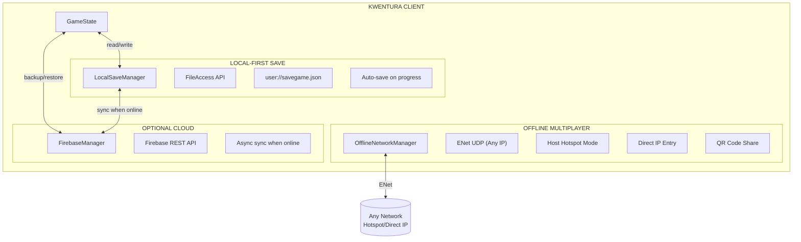
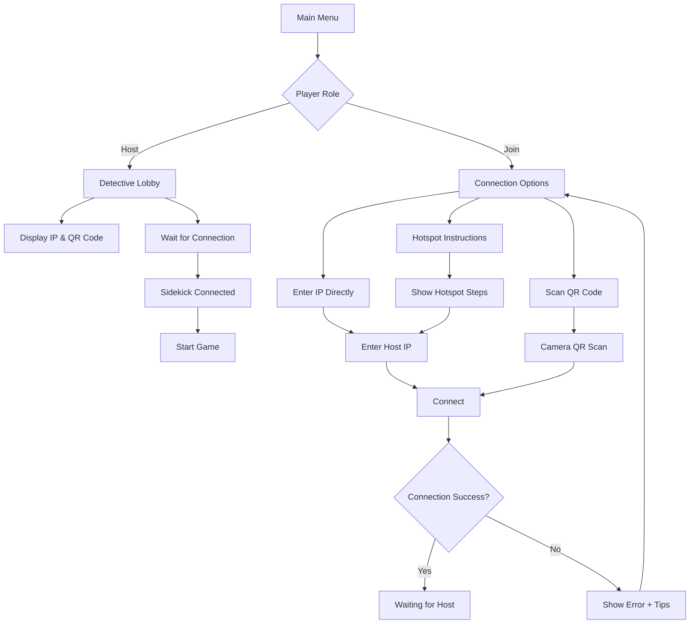

# Offline LAN Multiplayer & Local-First Save Implementation Plan

## Overview

This plan transforms Kwentura into a **truly offline-capable** game:
1. **LAN Multiplayer**: Works WITHOUT same Wi-Fi (hotspot/direct IP modes)
2. **Local-First Save**: Primary storage on device, Firebase as optional cloud backup

---

## Architecture Overview



---

## Part 1: Local-First Save System

### 1.1 LocalSaveManager (New Autoload)

**File**: `scripts/systems/local_save_manager.gd`

**Purpose**: Primary save/load system using device storage. Works 100% offline.

```gdscript
extends Node

## Local Save Manager - Primary save system (Local-First Architecture)
## Uses FileAccess for JSON-based save files in user:// directory

signal save_completed(success: bool, error_message: String)
signal load_completed(success: bool, data: Dictionary, error_message: String)
signal auto_save_triggered

const SAVE_FILE_NAME: String = "user://kwentura_save.json"
const BACKUP_FILE_NAME: String = "user://kwentura_save.backup"
const MAX_BACKUP_COUNT: int = 3

# Save metadata
var last_save_time: int = 0
var save_version: String = "1.0"
var total_saves: int = 0

# Auto-save settings
var auto_save_enabled: bool = true
var auto_save_interval_sec: float = 30.0
var _auto_save_timer: float = 0.0

func _ready():
    print("[LocalSaveManager] Initialized")
    # Ensure save directory exists
    _ensure_save_directory()

func _process(delta: float):
    if auto_save_enabled:
        _auto_save_timer += delta
        if _auto_save_timer >= auto_save_interval_sec:
            _auto_save_timer = 0.0
            _trigger_auto_save()

# ============================================================================
# PUBLIC API
# ============================================================================

## Save game data to local storage
func save_game(data: Dictionary) -> bool:
    var enriched_data = _enrich_save_data(data)
    
    # Create backup of existing save
    _create_backup()
    
    # Write to temp file first (atomic write)
    var temp_path = SAVE_FILE_NAME + ".tmp"
    var json_string = JSON.stringify(enriched_data, "\t")
    
    var file = FileAccess.open(temp_path, FileAccess.WRITE)
    if file == null:
        var error = FileAccess.get_open_error()
        push_error("[LocalSaveManager] Failed to open temp file: " + str(error))
        emit_signal("save_completed", false, "Failed to open file: " + str(error))
        return false
    
    file.store_string(json_string)
    file.close()
    
    # Atomic rename (prevents corruption if crash during write)
    var rename_error = DirAccess.rename_absolute(temp_path, SAVE_FILE_NAME)
    if rename_error != OK:
        push_error("[LocalSaveManager] Failed to rename temp file")
        emit_signal("save_completed", false, "Failed to finalize save")
        return false
    
    last_save_time = Time.get_unix_time_from_system()
    total_saves += 1
    
    print("[LocalSaveManager] Game saved successfully")
    emit_signal("save_completed", true, "")
    
    # Trigger cloud sync if available (non-blocking)
    _trigger_cloud_sync()
    
    return true

## Load game data from local storage
func load_game() -> Dictionary:
    if not has_save_file():
        print("[LocalSaveManager] No save file found")
        emit_signal("load_completed", false, {}, "No save file found")
        return {}
    
    var file = FileAccess.open(SAVE_FILE_NAME, FileAccess.READ)
    if file == null:
        var error = FileAccess.get_open_error()
        push_error("[LocalSaveManager] Failed to open save file: " + str(error))
        
        # Try to restore from backup
        return _restore_from_backup()
    
    var json_string = file.get_as_text()
    file.close()
    
    var data = JSON.parse_string(json_string)
    if data == null or not data is Dictionary:
        push_error("[LocalSaveManager] Save file is corrupted")
        return _restore_from_backup()
    
    # Validate save version
    if not _validate_save_version(data):
        push_warning("[LocalSaveManager] Save version mismatch, attempting migration")
        data = _migrate_save_data(data)
    
    print("[LocalSaveManager] Game loaded successfully")
    emit_signal("load_completed", true, data, "")
    return data

## Check if save file exists
func has_save_file() -> bool:
    return FileAccess.file_exists(SAVE_FILE_NAME)

## Delete save file (for reset/new game)
func delete_save() -> bool:
    if has_save_file():
        var error = DirAccess.remove_absolute(SAVE_FILE_NAME)
        if error == OK:
            print("[LocalSaveManager] Save file deleted")
            return true
    return false

## Get save file info for display
func get_save_info() -> Dictionary:
    if not has_save_file():
        return {"exists": false}
    
    var data = load_game()
    return {
        "exists": true,
        "last_save_time": data.get("_metadata", {}).get("timestamp", 0),
        "play_time": data.get("play_time_seconds", 0),
        "zones_completed": _count_completed_zones(data),
        "game_completed": data.get("game_completed", false)
    }

# ============================================================================
# PRIVATE HELPERS
# ============================================================================

func _enrich_save_data(data: Dictionary) -> Dictionary:
    """Add metadata to save data"""
    var enriched = data.duplicate(true)
    enriched["_metadata"] = {
        "version": save_version,
        "timestamp": Time.get_unix_time_from_system(),
        "platform": OS.get_name(),
        "total_saves": total_saves + 1
    }
    return enriched

func _validate_save_version(data: Dictionary) -> bool:
    var version = data.get("_metadata", {}).get("version", "0.0")
    return version == save_version

func _migrate_save_data(data: Dictionary) -> Dictionary:
    """Migrate older save versions to current version"""
    # Add migration logic here when needed
    return data

func _create_backup():
    """Create rotating backups of save file"""
    if not has_save_file():
        return
    
    # Shift existing backups
    for i in range(MAX_BACKUP_COUNT - 1, 0, -1):
        var old_backup = SAVE_FILE_NAME + ".backup" + str(i)
        var new_backup = SAVE_FILE_NAME + ".backup" + str(i + 1)
        if FileAccess.file_exists(old_backup):
            DirAccess.rename_absolute(old_backup, new_backup)
    
    # Create new backup
    DirAccess.copy_absolute(SAVE_FILE_NAME, BACKUP_FILE_NAME)

func _restore_from_backup() -> Dictionary:
    """Attempt to restore from backup files"""
    print("[LocalSaveManager] Attempting to restore from backup...")
    
    for i in range(1, MAX_BACKUP_COUNT + 1):
        var backup_path = SAVE_FILE_NAME + ".backup" + str(i)
        if FileAccess.file_exists(backup_path):
            var file = FileAccess.open(backup_path, FileAccess.READ)
            if file:
                var data = JSON.parse_string(file.get_as_text())
                file.close()
                if data != null and data is Dictionary:
                    print("[LocalSaveManager] Restored from backup ", i)
                    emit_signal("load_completed", true, data, "Restored from backup")
                    return data
    
    emit_signal("load_completed", false, {}, "All save files corrupted")
    return {}

func _ensure_save_directory():
    """Ensure the save directory exists"""
    var dir = DirAccess.open("user://")
    if dir == null:
        push_error("[LocalSaveManager] Cannot access user directory")

func _trigger_auto_save():
    """Trigger auto-save if game is active"""
    if GameState and GameState.get_collected_count() > 0:
        emit_signal("auto_save_triggered")
        save_game(GameState.get_save_data())

func _trigger_cloud_sync():
    """Non-blocking cloud sync trigger"""
    # Call FirebaseManager if available and online
    if FirebaseManager and FirebaseManager.is_authenticated:
        FirebaseManager.sync_to_cloud()

func _count_completed_zones(data: Dictionary) -> int:
    var count = 0
    var clues = data.get("collected_clues", {})
    for zone_id in clues.keys():
        if clues[zone_id].get("collected", false):
            count += 1
    return count
```

### 1.2 Updated GameState Integration

**Changes to `scripts/systems/game_state.gd`**:

```gdscript
# Replace Firebase calls with LocalSaveManager calls

func collect_clue(zone_id: String) -> bool:
    # ... existing logic ...
    
    # Auto-save to LOCAL storage first (always works)
    if LocalSaveManager:
        LocalSaveManager.save_game(get_save_data())
    
    # Optional: Cloud backup (non-blocking)
    if FirebaseManager and FirebaseManager.is_authenticated:
        FirebaseManager.save_progress_async()  # Don't wait for response
    
    return true

func _ready():
    randomize()
    
    # Load from LOCAL storage on startup
    _load_local_save()

func _load_local_save():
    var data = LocalSaveManager.load_game()
    if data.size() > 0:
        load_save_data(data)
        print("[GameState] Loaded from local save")
    else:
        print("[GameState] No local save found, starting fresh")
        # Optionally try to load from cloud
        if FirebaseManager and FirebaseManager.is_authenticated:
            FirebaseManager.load_progress()
```

### 1.3 Updated FirebaseManager (Cloud Backup Role)

**Changes to `scripts/systems/firebase_manager.gd`**:

```gdscript
# Firebase Manager now acts as CLOUD BACKUP only
# Primary save is always LocalSaveManager

const SYNC_INTERVAL_MINUTES: int = 5
var _last_sync_time: int = 0
var _pending_cloud_sync: bool = false

## Called when local save completes - triggers async cloud sync
func sync_to_cloud():
    if not is_authenticated or user_id.is_empty():
        return
    
    var now = Time.get_unix_time_from_system()
    if now - _last_sync_time < SYNC_INTERVAL_MINUTES * 60:
        _pending_cloud_sync = true
        return
    
    _perform_cloud_sync()

func _perform_cloud_sync():
    var local_data = LocalSaveManager.load_game()
    if local_data.size() == 0:
        return
    
    # Get cloud data to check if local is newer
    FirebaseFirestore.load_game_state_for_comparison()
    # Compare timestamps and merge if needed
    # Then save to cloud
    FirebaseFirestore.save_game_state(user_id, local_data)
    _last_sync_time = Time.get_unix_time_from_system()
    _pending_cloud_sync = false

## Load from cloud and merge with local (cloud wins on conflict)
func restore_from_cloud():
    if not is_authenticated:
        emit_signal("load_failed", "Not authenticated")
        return
    FirebaseFirestore.load_game_state()
```

---

## Part 2: Totally Offline LAN Multiplayer

### 2.1 Connection Modes

The new system supports 3 connection modes:

| Mode | Use Case | How It Works |
|------|----------|--------------|
| **Hotspot Host** | No Wi-Fi router available | Host creates mobile hotspot, sidekick connects to it |
| **Direct IP** | Both on same network (any) | Enter IP address directly |
| **QR Code** | Easy connection sharing | Scan QR to get IP + port + room code |

### 2.2 OfflineNetworkManager (Refactored)

**File**: `scripts/systems/offline_network_manager.gd` (replaces network_manager.gd)

```gdscript
extends Node

## Offline Network Manager - LAN Multiplayer without Wi-Fi requirement
## Supports: Hotspot mode, Direct IP, QR Code sharing

enum ConnectionMode {
    HOTSPAP_HOST,      # Host creates hotspot
    HOTSPOT_CLIENT,    # Client connects to host's hotspot
    DIRECT_IP,         # Direct IP entry
    QR_CODE            # QR code scanning/sharing
}

enum ConnectionState {
    DISCONNECTED,
    CONNECTING,
    HOSTING,
    CONNECTED,
    PLAYING,
    DISCONNECTING
}

enum Role { NONE, DETECTIVE, SIDEKICK }

# Network Configuration
const DEFAULT_PORT: int = 17777
const MAX_PLAYERS: int = 2
const CONNECTION_TIMEOUT_SEC: float = 10.0

# Signals
signal connection_state_changed(new_state: int, old_state: int)
signal connection_established(peer_id: int)
signal connection_failed(error: String)
signal player_connected(peer_id: int)
signal player_disconnected(peer_id: int)
signal game_started(checkpoint: String)
signal game_paused(reason: String)
signal game_resumed
signal host_ip_discovered(ip: String, code: String)

# State
var _state: ConnectionState = ConnectionState.DISCONNECTED
var _multiplayer_peer: ENetMultiplayerPeer = null
var _local_role: Role = Role.NONE
var _local_peer_id: int = 0
var _partner_peer_id: int = 0
var _is_host: bool = false
var _invite_code: String = ""
var _session_seed: int = 0

# Connection info (for display/sharing)
var _host_ip: String = ""
var _connection_mode: ConnectionMode = ConnectionMode.DIRECT_IP

# ============================================================================
# HOTSPAP MODE - Host creates Wi-Fi hotspot
# ============================================================================

## Host a game (works in Hotspot mode or regular Wi-Fi)
func host_game() -> Dictionary:
    if _state != ConnectionState.DISCONNECTED:
        return {"error": "Already connected", "success": false}
    
    _change_state(ConnectionState.CONNECTING)
    
    # Create ENet server
    _multiplayer_peer = ENetMultiplayerPeer.new()
    var error = _multiplayer_peer.create_server(DEFAULT_PORT, MAX_PLAYERS)
    
    if error != OK:
        _change_state(ConnectionState.DISCONNECTED)
        return {"error": "Failed to create server: " + str(error), "success": false}
    
    multiplayer.multiplayer_peer = _multiplayer_peer
    
    _local_peer_id = 1
    _is_host = true
    _local_role = Role.DETECTIVE
    GameState.assign_role(GameState.Role.DETECTIVE)
    
    _invite_code = _generate_invite_code()
    _session_seed = randi()
    _host_ip = _get_host_ip()
    
    # Store world progress
    _world_progress = {
        "collected_clues": {},
        "zones_status": GameState.zones_status.duplicate(),
        "current_zone": "forest_hub",
        "session_seed": _session_seed
    }
    
    GameState.set_session_seed(_session_seed)
    
    _change_state(ConnectionState.HOSTING)
    
    emit_signal("connection_established", _local_peer_id)
    emit_signal("host_ip_discovered", _host_ip, _invite_code)
    
    print("[OfflineNetwork] Hosting on ", _host_ip, ":", DEFAULT_PORT)
    print("[OfflineNetwork] Invite code: ", _invite_code)
    
    return {
        "success": true,
        "invite_code": _invite_code,
        "host_ip": _host_ip,
        "port": DEFAULT_PORT,
        "qr_data": _generate_qr_data()
    }

## Get connection info for sharing (QR code, etc.)
func get_host_connection_info() -> Dictionary:
    return {
        "ip": _host_ip,
        "port": DEFAULT_PORT,
        "code": _invite_code,
        "qr_string": _generate_qr_data()
    }

func _generate_qr_data() -> String:
    """Generate QR code string: KWENTURA|IP|PORT|CODE"""
    return "KWENTURA|%s|%d|%s" % [_host_ip, DEFAULT_PORT, _invite_code]

# ============================================================================
# DIRECT IP CONNECTION
# ============================================================================

## Join using direct IP (works across any network configuration)
func join_with_ip(host_ip: String, code: String = "") -> Dictionary:
    if _state != ConnectionState.DISCONNECTED:
        return {"error": "Already connected", "success": false}
    
    print("[OfflineNetwork] Connecting to ", host_ip, ":", DEFAULT_PORT)
    
    _change_state(ConnectionState.CONNECTING)
    
    _multiplayer_peer = ENetMultiplayerPeer.new()
    var error = _multiplayer_peer.create_client(host_ip, DEFAULT_PORT)
    
    if error != OK:
        _change_state(ConnectionState.DISCONNECTED)
        return {"error": "Failed to create client: " + str(error), "success": false}
    
    multiplayer.multiplayer_peer = _multiplayer_peer
    _local_role = Role.SIDEKICK
    GameState.assign_role(GameState.Role.SIDEKICK)
    _invite_code = code
    
    # Wait for connection with timeout
    var attempts = 0
    var max_attempts = int(CONNECTION_TIMEOUT_SEC / 0.1)
    
    while attempts < max_attempts:
        await get_tree().create_timer(0.1).timeout
        
        if _state == ConnectionState.CONNECTED:
            return {"success": true}
        
        if _state == ConnectionState.DISCONNECTED:
            return {
                "error": "Connection failed. Troubleshooting:\n• Check IP address\n• Ensure host is reachable\n• Try hotspot mode",
                "success": false
            }
        
        attempts += 1
    
    _cleanup()
    _change_state(ConnectionState.DISCONNECTED)
    return {
        "error": "Connection timeout. Troubleshooting:\n• Verify IP is correct\n• Check firewall settings\n• Use same hotspot",
        "success": false
    }

## Parse QR code data
func parse_qr_data(qr_string: String) -> Dictionary:
    var parts = qr_string.split("|")
    if parts.size() < 4 or parts[0] != "KWENTURA":
        return {"error": "Invalid QR code"}
    
    return {
        "ip": parts[1],
        "port": int(parts[2]),
        "code": parts[3]
    }

## Join using QR code data
func join_with_qr(qr_string: String) -> Dictionary:
    var data = parse_qr_data(qr_string)
    if data.has("error"):
        return {"error": data.error, "success": false}
    
    return await join_with_ip(data.ip, data.code)

# ============================================================================
# IP DETECTION (Works with Hotspots)
# ============================================================================

func _get_host_ip() -> String:
    """Get best IP for hosting (works with hotspots)"""
    var ips = IP.get_local_addresses()
    print("[OfflineNetwork] Available IPs: ", ips)
    
    # Priority 1: Hotspot addresses (common mobile hotspot ranges)
    for ip in ips:
        if ip.begins_with("192.168.43.") or ip.begins_with("192.168.44."):
            # Android hotspot default range
            print("[OfflineNetwork] Android Hotspot IP: ", ip)
            return ip
        if ip.begins_with("172.20.10."):
            # iOS Personal Hotspot range
            print("[OfflineNetwork] iOS Hotspot IP: ", ip)
            return ip
    
    # Priority 2: Common private networks
    for ip in ips:
        if ip.begins_with("192.168.") or ip.begins_with("10.") or ip.begins_with("172."):
            if not ip.begins_with("127."):
                print("[OfflineNetwork] Local Network IP: ", ip)
                return ip
    
    # Fallback: Any valid IPv4 (excluding loopback)
    for ip in ips:
        if "." in ip and not ip.begins_with("127.") and not ip.begins_with("0."):
            print("[OfflineNetwork] Fallback IP: ", ip)
            return ip
    
    # Last resort
    print("[OfflineNetwork] Using localhost fallback")
    return "127.0.0.1"

# ============================================================================
# INSTRUCTIONS FOR PLAYERS
# ============================================================================

func get_connection_instructions() -> Dictionary:
    """Get human-readable instructions for current connection mode"""
    if _is_host:
        return {
            "title": "Host Instructions",
            "steps": [
                "1. Ensure your device allows incoming connections",
                "2. Share your IP (%s) and code (%s) with partner" % [_host_ip, _invite_code],
                "3. OR have them scan the QR code",
                "4. Wait for partner to connect",
                "5. Click 'Start Game' when ready"
            ],
            "troubleshooting": [
                "• If on different networks: Enable mobile hotspot",
                "• Android: Settings → Mobile Hotspot → Enable",
                "• iOS: Settings → Personal Hotspot → Enable",
                "• Share hotspot password with partner"
            ]
        }
    else:
        return {
            "title": "Connection Options",
            "options": [
                {
                    "name": "Same Wi-Fi",
                    "description": "Enter host's IP address directly"
                },
                {
                    "name": "Hotspot Mode", 
                    "description": "Connect to host's mobile hotspot, then enter IP"
                },
                {
                    "name": "QR Code",
                    "description": "Scan host's QR code (auto-connects)"
                }
            ]
        }
```

### 2.3 Connection UI Flow



---

## Part 3: Implementation Phases

### Phase 1: Local Save System (Priority: HIGH)

**Files to Create/Modify**:
1. ✅ `scripts/systems/local_save_manager.gd` (NEW)
2. 📝 `scripts/systems/game_state.gd` (MODIFY - replace Firebase calls)
3. 📝 `project.godot` (ADD autoload for LocalSaveManager)

**Testing Checklist**:
- [ ] Save game progresses to local file
- [ ] Load game restores progress from local file
- [ ] Auto-save triggers on clue collection
- [ ] Backup system works (corruption recovery)
- [ ] Save data persists after app restart

### Phase 2: Firebase as Cloud Backup (Priority: MEDIUM)

**Files to Modify**:
1. 📝 `scripts/systems/firebase_manager.gd` (REFACTOR)
2. 📝 `scripts/systems/firebase_firestore.gd` (ADD sync methods)

**Testing Checklist**:
- [ ] Local save works without internet
- [ ] Cloud sync triggers when online
- [ ] Conflict resolution (local vs cloud timestamps)
- [ ] Manual "Restore from Cloud" option works

### Phase 3: Offline Multiplayer (Priority: HIGH)

**Files to Create/Modify**:
1. ✅ `scripts/systems/offline_network_manager.gd` (NEW - refactor from existing)
2. 📝 `scripts/mainMenu/detective_lobby.gd` (MODIFY - show IP/QR)
3. 📝 `scripts/mainMenu/sidekick_waiting.gd` (MODIFY - connection options)
4. 📝 `scenes/mainMenu/DetectiveLobby.tscn` (ADD QR display)
5. 📝 `scenes/mainMenu/SidekickWaiting.tscn` (ADD connection mode selector)

**Testing Checklist**:
- [ ] Host displays IP and QR code
- [ ] Sidekick can connect via direct IP
- [ ] Sidekick can connect via QR code
- [ ] Connection works through mobile hotspot
- [ ] Connection fails gracefully with helpful messages

---

## Part 4: Technical Details

### File Access Paths

| Platform | `user://` Path |
|----------|----------------|
| Android | `/data/data/[package]/files/` |
| iOS | `Documents/` |
| Windows | `%APPDATA%/Godot/app_userdata/Kwentura/` |
| Mac/Linux | `~/.local/share/godot/app_userdata/Kwentura/` |

### QR Code Format

```
KWENTURA|192.168.43.1|17777|ABC123
```

Components:
- `KWENTURA`: Protocol identifier
- `192.168.43.1`: Host IP address
- `17777`: Port number
- `ABC123`: Room code for validation

### Save File Structure

```json
{
    "collected_clues": { ... },
    "zones_status": { ... },
    "current_zone": "forest_hub",
    "game_completed": false,
    "play_time_seconds": 3600,
    "_metadata": {
        "version": "1.0",
        "timestamp": 1700000000,
        "platform": "Android",
        "total_saves": 42
    }
}
```

---

## Part 5: User Facing Instructions

### For Host (Detective)

```
📱 HOST INSTRUCTIONS

Option 1: Same Wi-Fi
→ Your IP: 192.168.1.5
→ Room Code: ABC123
→ Share these with your partner

Option 2: Mobile Hotspot (No Wi-Fi)
1. Enable Mobile Hotspot in settings
2. Share hotspot password with partner
3. Wait for them to connect to your hotspot
4. Share your IP and room code

Option 3: QR Code
→ Show this QR code to your partner
→ They scan it to auto-connect
```

### For Client (Sidekick)

```
📱 CONNECTION OPTIONS

[Enter IP Directly]      [Scan QR Code]

━━━━━━━━━━━━━━━━━━━━━━━━━━━━━━━━━━
🛜 Same Wi-Fi Network:
   Ask host for their IP address

📶 Hotspot Mode:
   1. Connect to host's mobile hotspot
   2. Enter the IP they provide

💡 Connection Problems?
   • Ensure you're on the same network
   • Try disabling mobile data
   • Check firewall settings
```

---

## Appendix: Godot FileAccess API Reference

### Writing Files
```gdscript
var file = FileAccess.open("user://save.json", FileAccess.WRITE)
file.store_string(JSON.stringify(data))
file.close()
```

### Reading Files
```gdscript
if FileAccess.file_exists("user://save.json"):
    var file = FileAccess.open("user://save.json", FileAccess.READ)
    var data = JSON.parse_string(file.get_as_text())
    file.close()
```

### Error Handling
```gdscript
var file = FileAccess.open("user://save.json", FileAccess.WRITE)
if file == null:
    var error = FileAccess.get_open_error()
    print("Error: ", error)
```

---

## Summary

This plan enables:

1. ✅ **100% Offline Save**: Local JSON files using FileAccess
2. ✅ **Cross-Device Sync**: Firebase as optional cloud backup
3. ✅ **True Offline Multiplayer**: Hotspot mode + Direct IP + QR codes
4. ✅ **Graceful Degradation**: Game works fully without internet
5. ✅ **Easy Connection**: Multiple connection methods for any situation
