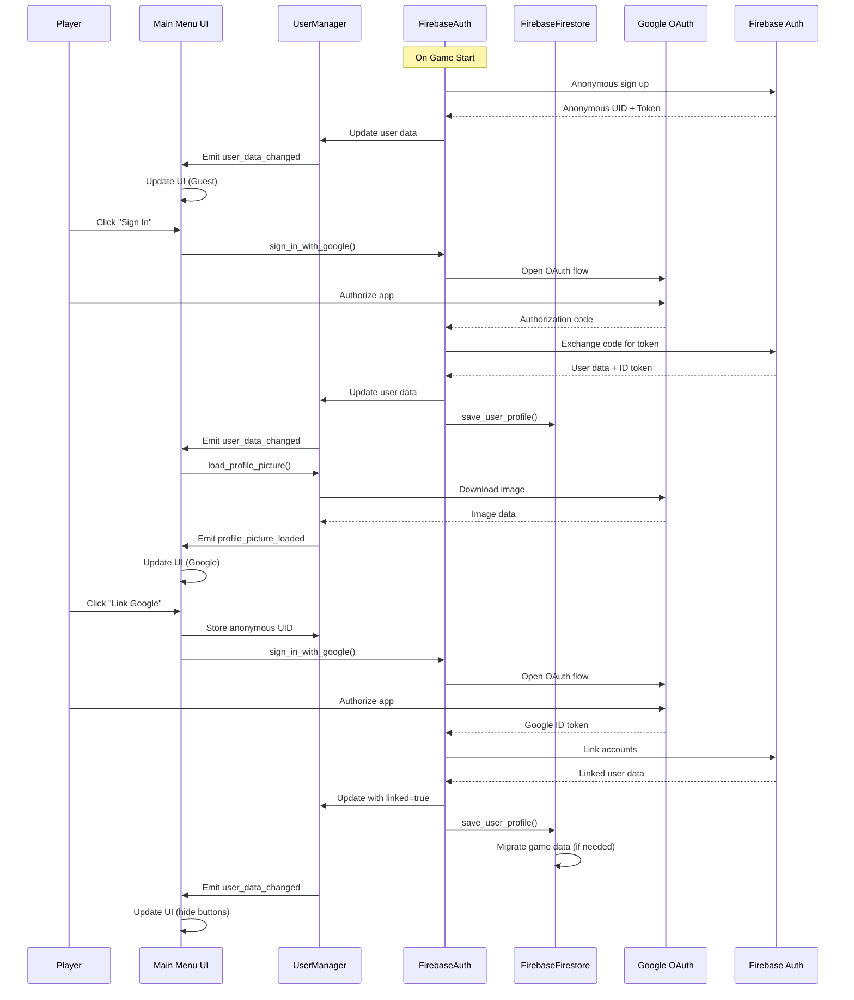

# Google Sign-In Implementation Plan

## Overview
Implement Google account authentication with Firebase, allowing players to sign in and link their accounts. Store user information in Firestore and display Google profile picture in the user profile UI.

## Current State Analysis

### Existing UI (MainMenu.tscn)
The settings panel already has:
- **Sign In button**: Currently not connected to any logic
- **Guest button**: Currently not connected to any logic  
- **Link Google button**: Currently not connected to any logic
- **AvatarTexture**: Displays `userIcon.png` (placeholder)
- **DisplayName label**: Shows `"Player Name"` (placeholder)
- **ProviderLabel**: Shows `"Guest"` (placeholder)

### Existing Firebase Setup
- `FirebaseAuth.gd`: Anonymous login only
- `FirebaseManager.gd`: Handles save/load coordination
- `FirebaseFirestore.gd`: Game state storage

---

## Implementation Plan

### Phase 1: User Data Management

#### 1.1 Create UserManager Singleton
**File**: `scripts/systems/user_manager.gd`

```gdscript
## UserManager - Manages user authentication state and profile data
extends Node

# User data structure
var user_data: Dictionary = {
    "user_id": "",
    "display_name": "Guest",
    "email": "",
    "photo_url": "",
    "provider": "anonymous",  # "anonymous" | "google"
    "is_linked": false,
    "anonymous_uid": ""  # Store original anonymous UID for account linking
}

# Signals
signal user_data_changed(data: Dictionary)
signal profile_picture_loaded(texture: Texture2D)
signal linking_completed(success: bool)
signal linking_failed(error: String)

# Cached profile texture
var _profile_texture: Texture2D = null

func _ready():
    # Load saved user data from local storage
    _load_user_data()

func get_user_data() -> Dictionary:
    return user_data.duplicate()

func is_logged_in() -> bool:
    return not user_data.user_id.is_empty()

func is_google_linked() -> bool:
    return user_data.provider == "google" and user_data.is_linked

func update_user_data(new_data: Dictionary) -> void:
    user_data.merge(new_data, true)
    _save_user_data()
    emit_signal("user_data_changed", user_data.duplicate())

func clear_user_data() -> void:
    user_data = {
        "user_id": "",
        "display_name": "Guest",
        "email": "",
        "photo_url": "",
        "provider": "anonymous",
        "is_linked": false,
        "anonymous_uid": ""
    }
    _profile_texture = null
    _save_user_data()
    emit_signal("user_data_changed", user_data.duplicate())

# Profile picture loading
func load_profile_picture(url: String) -> void:
    if url.is_empty():
        emit_signal("profile_picture_loaded", null)
        return
    
    var http = HTTPRequest.new()
    add_child(http)
    http.request_completed.connect(_on_profile_image_downloaded.bind(http))
    http.request(url)

func _on_profile_image_downloaded(result, response_code, headers, body, http):
    if result == OK and response_code == 200:
        var image = Image.new()
        var image_error = image.load_jpg_from_buffer(body)
        if image_error != OK:
            image_error = image.load_png_from_buffer(body)
        
        if image_error == OK:
            var texture = ImageTexture.create_from_image(image)
            _profile_texture = texture
            emit_signal("profile_picture_loaded", texture)
    
    http.queue_free()

func get_cached_profile_texture() -> Texture2D:
    return _profile_texture

# Local persistence
func _save_user_data() -> void:
    var file = FileAccess.open("user://user_data.json", FileAccess.WRITE)
    if file:
        file.store_string(JSON.stringify(user_data))
        file.close()

func _load_user_data() -> void:
    if FileAccess.file_exists("user://user_data.json"):
        var file = FileAccess.open("user://user_data.json", FileAccess.READ)
        if file:
            var json = JSON.new()
            var error = json.parse(file.get_as_text())
            if error == OK:
                var loaded = json.get_data()
                if loaded is Dictionary:
                    user_data.merge(loaded, true)
            file.close()
```

---

### Phase 2: Enhanced Firebase Authentication

#### 2.1 Extend FirebaseAuth.gd

Add Google Sign-In support and account linking capabilities:

```gdscript
# Add to FirebaseAuth.gd

# OAuth configuration
const GOOGLE_CLIENT_ID = "YOUR_GOOGLE_CLIENT_ID.apps.googleusercontent.com"
const REDIRECT_URI = "http://localhost:8080"  # For desktop/mobile OAuth flow

# Signals
signal google_auth_success(user_data: Dictionary)
signal google_auth_failed(error: String)
signal account_linked_success(user_data: Dictionary)
signal account_link_failed(error: String)

# Google Sign-In via OAuth 2.0
func sign_in_with_google():
    ## Note: Godot doesn't have built-in Google Sign-In SDK
    ## We use Firebase's REST API with OAuth 2.0 flow
    ## For mobile: Consider using Godot Android/iOS plugin
    ## For now: Implement web-based OAuth flow
    
    _open_google_oauth_flow()

func _open_google_oauth_flow():
    # Build OAuth URL
    var oauth_url = (
        "https://accounts.google.com/o/oauth2/v2/auth?" +
        "client_id=" + GOOGLE_CLIENT_ID +
        "&redirect_uri=" + REDIRECT_URI.uri_encode() +
        "&response_type=code" +
        "&scope=openid%20email%20profile" +
        "&prompt=select_account"
    )
    
    # Open browser for OAuth (desktop/mobile)
    OS.shell_open(oauth_url)
    
    # Start local HTTP server to receive callback (desktop only)
    # For mobile, use deep linking or custom URL scheme
    _start_oauth_callback_server()

func _start_oauth_callback_server():
    # Implementation for desktop OAuth callback
    # This requires a TCP server to listen for the redirect
    pass

# Exchange OAuth code for Firebase ID token
func _exchange_code_for_token(code: String):
    var url = "https://identitytoolkit.googleapis.com/v1/accounts:signInWithIdp?key=" + API_KEY
    var headers = ["Content-Type: application/json"]
    var body = JSON.stringify({
        "postBody": "id_token=" + code + "&providerId=google.com",
        "requestUri": REDIRECT_URI,
        "returnIdpCredential": true,
        "returnSecureToken": true
    })
    
    var http = HTTPRequest.new()
    add_child(http)
    http.request_completed.connect(_on_google_signin_response.bind(http))
    http.request(url, headers, HTTPClient.METHOD_POST, body)

func _on_google_signin_response(result, response_code, headers, body, http):
    if response_code == 200:
        var json = JSON.parse_string(body.get_string_from_utf8())
        if json and json.has("localId"):
            var user_data = {
                "user_id": json["localId"],
                "display_name": json.get("displayName", "Google User"),
                "email": json.get("email", ""),
                "photo_url": json.get("photoUrl", ""),
                "id_token": json["idToken"],
                "provider": "google"
            }
            current_user_id = user_data.user_id
            id_token = user_data.id_token
            is_authenticated = true
            emit_signal("google_auth_success", user_data)
        else:
            emit_signal("google_auth_failed", "Invalid response")
    else:
        emit_signal("google_auth_failed", body.get_string_from_utf8())
    
    http.queue_free()

# Link anonymous account with Google
func link_with_google(google_id_token: String):
    var url = "https://identitytoolkit.googleapis.com/v1/accounts:update?key=" + API_KEY
    var headers = ["Content-Type: application/json"]
    var body = JSON.stringify({
        "idToken": id_token,  # Current anonymous user's token
        "postBody": "id_token=" + google_id_token + "&providerId=google.com",
        "returnSecureToken": true
    })
    
    var http = HTTPRequest.new()
    add_child(http)
    http.request_completed.connect(_on_link_account_response.bind(http))
    http.request(url, headers, HTTPClient.METHOD_POST, body)

func _on_link_account_response(result, response_code, headers, body, http):
    if response_code == 200:
        var json = JSON.parse_string(body.get_string_from_utf8())
        var user_data = {
            "user_id": json["localId"],
            "display_name": json.get("displayName", ""),
            "email": json.get("email", ""),
            "photo_url": json.get("photoUrl", ""),
            "provider": "google",
            "is_linked": true
        }
        emit_signal("account_linked_success", user_data)
    else:
        emit_signal("account_link_failed", body.get_string_from_utf8())
    
    http.queue_free()
```

**Note**: For mobile platforms (Android/iOS), the OAuth flow differs. Consider using platform-specific plugins or the Firebase SDK integration.

---

### Phase 3: User Data in Firestore

#### 3.1 Extend FirebaseFirestore.gd

```gdscript
# Add to FirebaseFirestore.gd

const USERS_COLLECTION = "users"

func save_user_profile(user_id: String, profile_data: Dictionary):
    if user_id.is_empty():
        print("Cannot save: No user ID")
        return
    
    var id_token = FirebaseAuth.id_token
    if id_token.is_empty():
        print("Cannot save: Not authenticated")
        return
    
    var url = BASE_URL + "/" + USERS_COLLECTION + "/" + user_id
    var headers = ["Content-Type: application/json", "Authorization: Bearer " + id_token]
    
    var doc = {
        "fields": {
            "display_name": {"stringValue": profile_data.get("display_name", "")},
            "email": {"stringValue": profile_data.get("email", "")},
            "photo_url": {"stringValue": profile_data.get("photo_url", "")},
            "provider": {"stringValue": profile_data.get("provider", "anonymous")},
            "is_linked": {"booleanValue": profile_data.get("is_linked", false)},
            "last_login": {"stringValue": str(Time.get_unix_time_from_system())}
        }
    }
    
    var body = JSON.stringify(doc)
    var http = HTTPRequest.new()
    add_child(http)
    http.request_completed.connect(_on_save_profile_response.bind(http))
    http.request(url, headers, HTTPClient.METHOD_PATCH, body)

func _on_save_profile_response(result, response_code, headers, body, http):
    if response_code == 200 or response_code == 201:
        print("User profile saved to Firestore")
    else:
        print("Profile save failed: ", response_code)
    http.queue_free()

func load_user_profile(user_id: String):
    if user_id.is_empty():
        return
    
    var id_token = FirebaseAuth.id_token
    if id_token.is_empty():
        return
    
    var url = BASE_URL + "/" + USERS_COLLECTION + "/" + user_id
    var headers = ["Authorization: Bearer " + id_token]
    
    var http = HTTPRequest.new()
    add_child(http)
    http.request_completed.connect(_on_load_profile_response.bind(http))
    http.request(url, headers, HTTPClient.METHOD_GET)

func _on_load_profile_response(result, response_code, headers, body, http):
    if response_code == 200:
        var json = JSON.parse_string(body.get_string_from_utf8())
        if json and json.has("fields"):
            var profile = _convert_from_firestore(json["fields"])
            # Emit signal or call back to update UserManager
            UserManager.update_user_data(profile)
    http.queue_free()
```

---

### Phase 4: UI Integration

#### 4.1 Update MainMenu.gd

Connect the auth buttons and update UI based on user state:

```gdscript
# Add to MainMenu.gd

@onready var avatar_texture: TextureRect = $SettingsPanel/UserSection/UserContent/AvatarTexture
@onready var display_name_label: Label = $SettingsPanel/UserSection/UserContent/UserInfo/DisplayName
@onready var provider_label: Label = $SettingsPanel/UserSection/UserContent/UserInfo/ProviderLabel

func _ready():
    # ... existing code ...
    
    # Connect auth buttons
    sign_in_button.pressed.connect(_on_sign_in_pressed)
    guest_button.pressed.connect(_on_guest_pressed)
    link_google_button.pressed.connect(_on_link_google_pressed)
    
    # Connect to UserManager signals
    UserManager.user_data_changed.connect(_on_user_data_changed)
    UserManager.profile_picture_loaded.connect(_on_profile_picture_loaded)
    
    # Connect to FirebaseAuth signals
    FirebaseAuth.google_auth_success.connect(_on_google_auth_success)
    FirebaseAuth.google_auth_failed.connect(_on_google_auth_failed)
    FirebaseAuth.account_linked_success.connect(_on_account_linked)
    FirebaseAuth.account_link_failed.connect(_on_link_failed)
    
    # Initialize UI
    _update_user_ui()

func _update_user_ui() -> void:
    var user_data = UserManager.get_user_data()
    
    # Update display name
    display_name_label.text = user_data.display_name if not user_data.display_name.is_empty() else "Guest"
    
    # Update provider label
    match user_data.provider:
        "google":
            provider_label.text = "Google Account"
            link_google_button.visible = false
            sign_in_button.visible = false
            guest_button.visible = false
        "anonymous":
            provider_label.text = "Guest"
            link_google_button.visible = true
            sign_in_button.visible = true
            guest_button.visible = true
    
    # Update avatar
    var cached = UserManager.get_cached_profile_texture()
    if cached:
        avatar_texture.texture = cached
    elif not user_data.photo_url.is_empty():
        UserManager.load_profile_picture(user_data.photo_url)
    else:
        avatar_texture.texture = preload("res://assets/sprites/userIcon.png")

func _on_user_data_changed(data: Dictionary) -> void:
    _update_user_ui()

func _on_profile_picture_loaded(texture: Texture2D) -> void:
    if texture:
        avatar_texture.texture = texture

# Button handlers
func _on_sign_in_pressed() -> void:
    FirebaseAuth.sign_in_with_google()
    _show_status("Opening Google Sign-In...")

func _on_guest_pressed() -> void:
    # Continue as anonymous - already handled by FirebaseAuth on startup
    _show_status("Continuing as Guest...")

func _on_link_google_pressed() -> void:
    if not FirebaseAuth.is_authenticated:
        _show_status("Please sign in anonymously first")
        return
    
    # Store current anonymous UID before linking
    UserManager.update_user_data({"anonymous_uid": FirebaseAuth.current_user_id})
    
    # Start Google sign-in flow
    FirebaseAuth.sign_in_with_google()
    _show_status("Linking Google account...")

# Firebase callbacks
func _on_google_auth_success(user_data: Dictionary) -> void:
    _show_status("Signed in successfully!")
    
    # Update UserManager
    UserManager.update_user_data(user_data)
    
    # Save to Firestore
    FirebaseFirestore.save_user_profile(user_data.user_id, user_data)
    
    # Load profile picture if available
    if not user_data.photo_url.is_empty():
        UserManager.load_profile_picture(user_data.photo_url)
    
    # Update UI
    _update_user_ui()

func _on_google_auth_failed(error: String) -> void:
    _show_status("Sign in failed: " + error)

func _on_account_linked(user_data: Dictionary) -> void:
    _show_status("Account linked successfully!")
    
    # Update with linked status
    user_data["is_linked"] = true
    UserManager.update_user_data(user_data)
    
    # Save to Firestore
    FirebaseFirestore.save_user_profile(user_data.user_id, user_data)
    
    _update_user_ui()

func _on_link_failed(error: String) -> void:
    _show_status("Linking failed: " + error)
```

---

### Phase 5: Alternative Implementation for Mobile

Since OAuth flow in pure GDScript is complex, here are alternatives:

#### Option A: Firebase REST API with Custom Token (Recommended)

Create a simple backend service or use Firebase Functions:

```gdscript
# Simplified approach using Firebase Custom Token
# This requires a backend endpoint to verify Google token

func sign_in_with_google_custom_token(google_access_token: String):
    # Send token to your backend
    # Backend verifies with Google and returns Firebase custom token
    # Exchange custom token for ID token
    pass
```

#### Option B: Godot Plugin Approach

For Android:
- Use Godot Android plugin with Firebase Auth SDK
- Call native Google Sign-In from GDScript

For iOS:
- Use Godot iOS plugin with Firebase Auth SDK

---

## Implementation Checklist

### Files to Create/Modify

1. **Create**: `scripts/systems/user_manager.gd`
   - [ ] User data structure
   - [ ] Local persistence
   - [ ] Profile picture loading
   - [ ] Signals for UI updates

2. **Modify**: `scripts/systems/firebase_auth.gd`
   - [ ] Google OAuth flow (or alternative)
   - [ ] Account linking endpoints
   - [ ] New signals for Google auth

3. **Modify**: `scripts/systems/firebase_firestore.gd`
   - [ ] `save_user_profile()` function
   - [ ] `load_user_profile()` function

4. **Modify**: `scripts/mainMenu/main_menu.gd`
   - [ ] Connect auth buttons
   - [ ] Update UI based on user state
   - [ ] Handle auth signals

5. **Modify**: `project.godot`
   - [ ] Add `UserManager` to autoloads

### UI Updates

- [ ] Update `AvatarTexture` with loaded profile picture
- [ ] Update `DisplayName` label
- [ ] Update `ProviderLabel` label
- [ ] Show/hide buttons based on auth state

### Firebase Setup

- [ ] Enable Google Sign-In in Firebase Console
- [ ] Configure OAuth consent screen
- [ ] Add authorized domains
- [ ] Update Firestore security rules for user profiles

### Firestore Security Rules

```javascript
rules_version = '2';
service cloud.firestore {
  match /databases/{database}/documents {
    // Allow users to read/write their own profile
    match /users/{userId} {
      allow read, write: if request.auth != null && request.auth.uid == userId;
    }
    
    // Allow users to read/write their own game state
    match /users/{userId}/game_state {
      allow read, write: if request.auth != null && request.auth.uid == userId;
    }
  }
}
```

---

## Data Flow Diagram



---

## Testing Checklist

- [ ] Anonymous login works on startup
- [ ] UI shows "Guest" for anonymous users
- [ ] Sign In button opens Google OAuth
- [ ] After Google sign-in, profile picture loads
- [ ] Display name updates correctly
- [ ] User data persists locally after restart
- [ ] User data syncs to Firestore
- [ ] Account linking works (guest → Google)
- [ ] Game progress persists after linking
- [ ] Buttons show/hide correctly based on state

---

## Notes

1. **Platform Considerations**: 
   - Desktop: OAuth flow with local server callback
   - Android/iOS: Native SDK integration recommended
   
2. **Security**: Never store OAuth credentials in code. Use environment variables or Firebase config.

3. **Offline Support**: UserManager caches data locally; syncs when online.

4. **Profile Picture**: Consider caching downloaded images to `user://` folder.
