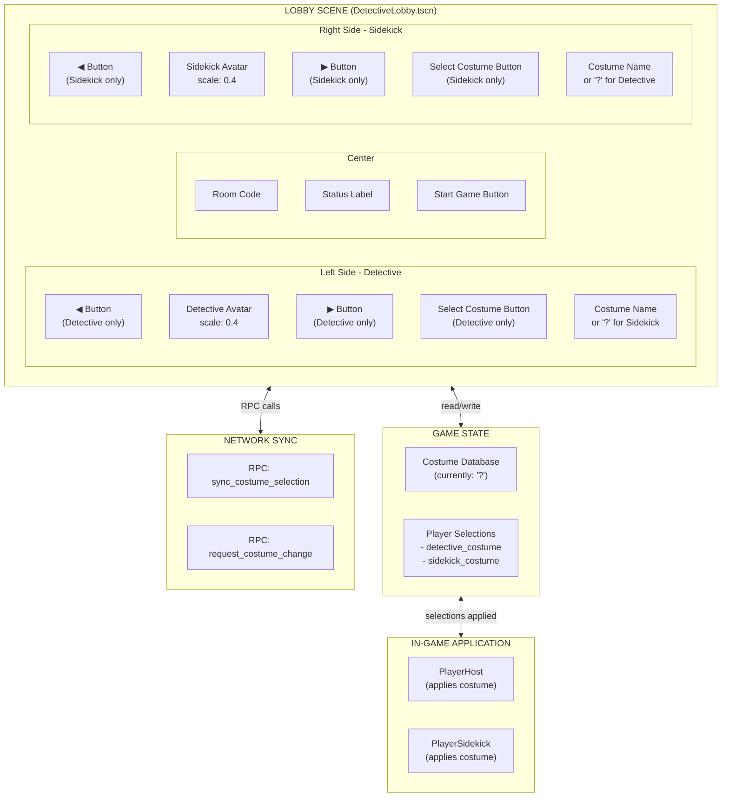

# Costume Selection Feature Implementation Plan

## Overview
Implement a costume selection system in the lobby where both players (Detective and Sidekick) can browse through available costumes using left/right arrow buttons and confirm their selection with a "Select Costume" button.

## Architecture Diagram



---

## Phase 1: Data Structure & Asset Organization

### 1.1 Costume Database Structure

Add to `GameState.gd`:

```gdscript
# Costume System
# NOTE: Costumes are not yet implemented. Using "?" placeholder for now.
# When costumes become available, replace the "?" with actual costume data.
const COSTUMES: Dictionary = {
    "detective": [
        {
            "id": "default",
            "name": "?",
            "description": "Mystery costume",
            "sprite_folder": "Detective",
            "unlocked": true
        }
    ],
    "sidekick": [
        {
            "id": "default", 
            "name": "?",
            "description": "Mystery costume",
            "sprite_folder": "Sidekick",
            "unlocked": true
        }
    ]
}

# Placeholder flag - set to true when costumes are implemented
const COSTUMES_IMPLEMENTED: bool = false

# Current selections (persisted through game session)
var selected_costumes: Dictionary = {
    "detective": "default",
    "sidekick": "default"
}

# Selection status for lobby UI
var costume_confirmed: Dictionary = {
    "detective": false,
    "sidekick": false
}

func get_costumes_for_role(role: String) -> Array:
    return COSTUMES.get(role, [])

func get_costume_by_id(role: String, costume_id: String) -> Dictionary:
    var costumes = get_costumes_for_role(role)
    for costume in costumes:
        if costume.id == costume_id:
            return costume
    return costumes[0] if costumes.size() > 0 else {}

func set_selected_costume(role: String, costume_id: String):
    selected_costumes[role] = costume_id

func get_selected_costume(role: String) -> String:
    return selected_costumes.get(role, "default")

func confirm_costume_selection(role: String, confirmed: bool = true):
    costume_confirmed[role] = confirmed
    emit_signal("costume_confirmed", role, confirmed)

func is_costume_confirmed(role: String) -> bool:
    return costume_confirmed.get(role, false)

func reset_costume_selections():
    selected_costumes = {"detective": "default", "sidekick": "default"}
    costume_confirmed = {"detective": false, "sidekick": false}
```

### 1.2 Add Signal to GameState

```gdscript
# Add to existing signals
signal costume_changed(role: String, costume_id: String)
signal costume_confirmed(role: String, confirmed: bool)
```

### 1.3 Asset Folder Structure

Create costume sprite folders:
```
assets/sprites/players/
├── Detective/                    # Default
│   ├── Detective_idle.png
│   └── Detective_walk.png
├── Detective_Noir/              # New costume
│   ├── Detective_Noir_idle.png
│   └── Detective_Noir_walk.png
├── Detective_Tropical/          # New costume
│   ├── Detective_Tropical_idle.png
│   └── Detective_Tropical_walk.png
├── Sidekick/                    # Default
│   ├── Sidekick_idle.png
│   └── Sidekick_walk.png
├── Sidekick_Tech/               # New costume
│   ├── Sidekick_Tech_idle.png
│   └── Sidekick_Tech_walk.png
└── Sidekick_Scout/              # New costume
    ├── Sidekick_Scout_idle.png
    └── Sidekick_Scout_walk.png
```

> **Note:** For initial implementation, you can use the same default sprites for all costumes. The system will be ready when new art is added.

---

## Phase 2: Scene Modifications

### Key UI Behavior Notes:

1. **Player-Specific Visibility**: Each player can ONLY see and interact with their OWN costume selection controls:
   - **Detective** sees: Detective area with full controls, Sidekick area with only avatar + "?"
   - **Sidekick** sees: Sidekick area with full controls, Detective area with only avatar + "?"

2. **"?" Placeholder**: Since costumes are not yet implemented:
   - Costume name label shows "?" 
   - Only ONE costume entry exists in the database per role
   - Arrow buttons have no effect (single item)
   - Select button confirms the "?" selection

### 2.1 DetectiveLobby.tscn Changes

#### New Scene Structure:
```
DetectiveLobby (Control)
├── Panel (background)
├── Title (Label)
├── RoomCode (Label)
├── StatusLabel (Label)
├── Button (Start Game)
├── Button2 (Back)
├── DetectiveArea (Control)             # NEW - Container for detective UI
│   ├── DetectiveLeftBtn (TextureButton) # NEW - leftBack2.png - HIDDEN for sidekick
│   ├── PlayerHost (CharacterBody2D)     # MODIFIED - scale 0.4, repositioned
│   │   ├── AnimatedSprite2D
│   │   └── DetectiveName (Label)
│   ├── DetectiveRightBtn (TextureButton) # NEW - rightBack2.png - HIDDEN for sidekick
│   ├── DetectiveCostumeName (Label)      # NEW - shows "?" or costume name
│   └── DetectiveSelectBtn (Button)       # NEW - "Select Costume" - HIDDEN for sidekick
├── SidekickArea (Control)                # NEW - Container for sidekick UI
│   ├── SidekickLeftBtn (TextureButton)   # NEW - leftBack2.png - HIDDEN for detective
│   ├── PlayerSidekick (CharacterBody2D)  # MODIFIED - scale 0.4, repositioned
│   │   ├── AnimatedSprite2D
│   │   └── SidekickName (Label)
│   ├── SidekickRightBtn (TextureButton)  # NEW - rightBack2.png - HIDDEN for detective
│   ├── SidekickCostumeName (Label)       # NEW - shows "?" or costume name
│   └── SidekickSelectBtn (Button)        # NEW - "Select Costume" - HIDDEN for detective
└── SidekickLabel (Label)            # Existing
```

**Visibility Rules:**
- If player is **Detective**: Only `DetectiveArea` buttons are visible. `SidekickArea` shows only avatar + "?" label.
- If player is **Sidekick**: Only `SidekickArea` buttons are visible. `DetectiveArea` shows only avatar + "?" label.

#### Position Adjustments:

| Element | Current | New |
|---------|---------|-----|
| PlayerHost position | (381, 685) | (300, 750) |
| PlayerHost scale | (0.7, 0.7) | (0.4, 0.4) |
| PlayerSidekick position | (1532, 685) | (1620, 750) |
| PlayerSidekick scale | (0.7, 0.7) | (0.4, 0.4) |
| DetectiveLeftBtn | - | (180, 750) |
| DetectiveRightBtn | - | (420, 750) |
| DetectiveSelectBtn | - | (220, 920) |
| SidekickLeftBtn | - | (1500, 750) |
| SidekickRightBtn | - | (1740, 750) |
| SidekickSelectBtn | - | (1540, 920) |

#### Button Assets:

**Arrow Buttons (Left/Right):**
- Use existing texture assets:
  - Left: `res://assets/buttons/leftBack2.png` (300x300px)
  - Right: `res://assets/buttons/rightBack2.png` (300x300px)
- Display: TextureButton node
- Scale: 0.25 (results in 75x75px display size)
- Position: Vertically centered with avatar

**Select Costume Button:**
- Style: Same as "Start Game" button (white bg, rounded corners)
- Size: 240x70 (smaller than Start Game's 652x93)
- Font: Minecraft.ttf, size 28
- Text: "Select Costume"
- Disabled style: Gray background (#A0A0A0) when confirmed

#### Scene Texture Imports:
```gdscript
[ext_resource type="Texture2D" uid="uid://..." path="res://assets/buttons/leftBack2.png" id="..."]
[ext_resource type="Texture2D" uid="uid://..." path="res://assets/buttons/rightBack2.png" id="..."]
```

#### TextureButton Configuration:
```gdscript
[node name="DetectiveLeftBtn" type="TextureButton" parent="DetectiveArea"]
layout_mode = 0
offset_left = 180.0
offset_top = 712.0
offset_right = 480.0  # 300px width
offset_bottom = 1012.0 # 300px height
scale = Vector2(0.25, 0.25)  # Scales to 75x75
texture_normal = ExtResource("...")  # leftBack2.png
ignore_texture_size = true
stretch_mode = 0

[node name="DetectiveRightBtn" type="TextureButton" parent="DetectiveArea"]
layout_mode = 0
offset_left = 345.0
offset_top = 712.0
offset_right = 645.0
offset_bottom = 1012.0
scale = Vector2(0.25, 0.25)
texture_normal = ExtResource("...")  # rightBack2.png
ignore_texture_size = true
stretch_mode = 0
```

**Note:** Same configuration applies to `SidekickLeftBtn` and `SidekickRightBtn` with positions at (1500, 712) and (1665, 712) respectively.

---

## Phase 3: Costume Selection Logic

### 3.1 Add to detective_lobby.gd

```gdscript
# New onready variables
@onready var detective_left_btn: TextureButton = $DetectiveArea/DetectiveLeftBtn
@onready var detective_right_btn: TextureButton = $DetectiveArea/DetectiveRightBtn
@onready var detective_select_btn: Button = $DetectiveArea/DetectiveSelectBtn
@onready var detective_costume_label: Label = $DetectiveArea/DetectiveCostumeName

@onready var sidekick_left_btn: TextureButton = $SidekickArea/SidekickLeftBtn
@onready var sidekick_right_btn: TextureButton = $SidekickArea/SidekickRightBtn
@onready var sidekick_select_btn: Button = $SidekickArea/SidekickSelectBtn
@onready var sidekick_costume_label: Label = $SidekickArea/SidekickCostumeName

# Costume selection state
var _detective_costume_index: int = 0
var _sidekick_costume_index: int = 0
var _detective_costumes: Array = []
var _sidekick_costumes: Array = []

func _ready():
    # ... existing code ...
    
    # Initialize costume data
    _detective_costumes = GameState.get_costumes_for_role("detective")
    _sidekick_costumes = GameState.get_costumes_for_role("sidekick")
    
    # Setup UI based on role
    _setup_costume_selection_ui()
    
    # Connect costume signals
    GameState.costume_changed.connect(_on_costume_changed)
    GameState.costume_confirmed.connect(_on_costume_confirmed)
    
    # Connect button signals
    detective_left_btn.pressed.connect(_on_detective_left_pressed)
    detective_right_btn.pressed.connect(_on_detective_right_pressed)
    detective_select_btn.pressed.connect(_on_detective_select_pressed)
    
    sidekick_left_btn.pressed.connect(_on_sidekick_left_pressed)
    sidekick_right_btn.pressed.connect(_on_sidekick_right_pressed)
    sidekick_select_btn.pressed.connect(_on_sidekick_select_pressed)
    
    # Initial UI update
    _update_costume_display("detective")
    _update_costume_display("sidekick")

func _setup_costume_selection_ui():
    var my_role = NetworkManager.get_my_role()
    
    if my_role == "detective":
        # Detective can only see and customize THEIR OWN costume
        # Sidekick area: Hide ALL controls, show only avatar and "?" label
        _hide_costume_controls("sidekick")
        
        # Enable detective controls
        detective_left_btn.disabled = false
        detective_right_btn.disabled = false
        detective_select_btn.disabled = false
        detective_left_btn.visible = true
        detective_right_btn.visible = true
        detective_select_btn.visible = true
        detective_costume_label.visible = true
        
    else:
        # Sidekick can only see and customize THEIR OWN costume
        # Detective area: Hide ALL controls, show only avatar and "?" label
        _hide_costume_controls("detective")
        
        # Enable sidekick controls
        sidekick_left_btn.disabled = false
        sidekick_right_btn.disabled = false
        sidekick_select_btn.disabled = false
        sidekick_left_btn.visible = true
        sidekick_right_btn.visible = true
        sidekick_select_btn.visible = true
        sidekick_costume_label.visible = true


func _hide_costume_controls(role: String):
    """Hide all costume selection controls for the specified role's area.
    Only the avatar and costume name label remain visible."""
    if role == "detective":
        detective_left_btn.visible = false
        detective_right_btn.visible = false
        detective_select_btn.visible = false
        detective_costume_label.visible = true
        # Costume label shows "?" since we can't see partner's selection
        detective_costume_label.text = "?"
    else:
        sidekick_left_btn.visible = false
        sidekick_right_btn.visible = false
        sidekick_select_btn.visible = false
        sidekick_costume_label.visible = true
        # Costume label shows "?" since we can't see partner's selection
        sidekick_costume_label.text = "?"

func _on_detective_left_pressed():
    # If only "?" costume available, selection stays the same
    if _detective_costumes.size() <= 1:
        return
    _detective_costume_index -= 1
    if _detective_costume_index < 0:
        _detective_costume_index = _detective_costumes.size() - 1
    _change_costume("detective", _detective_costume_index)

func _on_detective_right_pressed():
    # If only "?" costume available, selection stays the same
    if _detective_costumes.size() <= 1:
        return
    _detective_costume_index += 1
    if _detective_costume_index >= _detective_costumes.size():
        _detective_costume_index = 0
    _change_costume("detective", _detective_costume_index)

func _on_detective_select_pressed():
    _confirm_costume("detective")

func _on_sidekick_left_pressed():
    # If only "?" costume available, selection stays the same
    if _sidekick_costumes.size() <= 1:
        return
    _sidekick_costume_index -= 1
    if _sidekick_costume_index < 0:
        _sidekick_costume_index = _sidekick_costumes.size() - 1
    _change_costume("sidekick", _sidekick_costume_index)

func _on_sidekick_right_pressed():
    # If only "?" costume available, selection stays the same
    if _sidekick_costumes.size() <= 1:
        return
    _sidekick_costume_index += 1
    if _sidekick_costume_index >= _sidekick_costumes.size():
        _sidekick_costume_index = 0
    _change_costume("sidekick", _sidekick_costume_index)

func _on_sidekick_select_pressed():
    _confirm_costume("sidekick")

func _change_costume(role: String, index: int):
    var costumes = _detective_costumes if role == "detective" else _sidekick_costumes
    if index < 0 or index >= costumes.size():
        return
    
    var costume = costumes[index]
    GameState.set_selected_costume(role, costume.id)
    GameState.emit_signal("costume_changed", role, costume.id)
    
    # Update display immediately
    _update_costume_display(role)
    
    # Sync to network (previews costume to partner)
    _sync_costume_preview.rpc(role, costume.id)

func _update_costume_display(role: String):
    var my_role = NetworkManager.get_my_role()
    var label = detective_costume_label if role == "detective" else sidekick_costume_label
    var select_btn = detective_select_btn if role == "detective" else sidekick_select_btn
    
    # Check if this is the local player's role or partner's role
    var is_local_player = (role == my_role)
    
    if is_local_player:
        # Show actual costume name (or "?" if not implemented)
        var costume_id = GameState.get_selected_costume(role)
        var costume = GameState.get_costume_by_id(role, costume_id)
        label.text = costume.get("name", "?")
        
        # Update button state
        var is_confirmed = GameState.is_costume_confirmed(role)
        select_btn.text = "Selected!" if is_confirmed else "Select Costume"
        select_btn.disabled = is_confirmed
    else:
        # Partner's costume - always show "?"
        label.text = "?"
        # Partner's select button is hidden, no need to update

func _update_avatar_sprite(role: String, costume: Dictionary):
    # This will load different sprite frames based on costume
    # For now, it uses the default sprites
    # When new art is added, update this to load from costume.sprite_folder
    pass

func _confirm_costume(role: String):
    GameState.confirm_costume_selection(role, true)
    
    # Sync confirmation to partner
    _sync_costume_confirmed.rpc(role, GameState.get_selected_costume(role))
    
    # Check if both players confirmed and enable start button
    if NetworkManager.get_my_role() == "detective":
        _check_can_start_game()

func _on_costume_changed(role: String, costume_id: String):
    _update_costume_display(role)

func _on_costume_confirmed(role: String, confirmed: bool):
    _update_costume_display(role)
    
    if NetworkManager.get_my_role() == "detective":
        _check_can_start_game()

func _check_can_start_game():
    # Optional: Require both costumes selected before starting
    # var detective_confirmed = GameState.is_costume_confirmed("detective")
    # var sidekick_confirmed = GameState.is_costume_confirmed("sidekick")
    # start_button.disabled = not (detective_confirmed and sidekick_confirmed and sidekick_connected)
    pass
```

---

## Phase 4: Network Synchronization

### 4.1 Add RPC Functions to detective_lobby.gd

```gdscript
# RPC: Preview costume change (not yet confirmed)
@rpc("any_peer", "reliable")
func _sync_costume_preview(role: String, costume_id: String):
    # Update our local state with partner's costume choice
    GameState.set_selected_costume(role, costume_id)
    _update_costume_display(role)
    
    # Update index to match
    var costumes = _detective_costumes if role == "detective" else _sidekick_costumes
    for i in range(costumes.size()):
        if costumes[i].id == costume_id:
            if role == "detective":
                _detective_costume_index = i
            else:
                _sidekick_costume_index = i
            break

# RPC: Confirm costume selection
@rpc("any_peer", "reliable")
func _sync_costume_confirmed(role: String, costume_id: String):
    GameState.set_selected_costume(role, costume_id)
    GameState.confirm_costume_selection(role, true)
    _update_costume_display(role)
    
    print("[Lobby] Partner confirmed costume: ", role, " = ", costume_id)

# RPC: Send costume selection on partner connect
@rpc("authority", "reliable")
func _receive_full_costume_state(detective_costume: String, sidekick_costume: String, 
                                  detective_confirmed: bool, sidekick_confirmed: bool):
    GameState.selected_costumes["detective"] = detective_costume
    GameState.selected_costumes["sidekick"] = sidekick_costume
    GameState.costume_confirmed["detective"] = detective_confirmed
    GameState.costume_confirmed["sidekick"] = sidekick_confirmed
    
    _update_costume_display("detective")
    _update_costume_display("sidekick")
```

### 4.2 Modify _on_partner_connected

```gdscript
func _on_partner_connected(data: Dictionary):
    sidekick_connected = true
    
    if NetworkManager.get_my_role() == "detective":
        # ... existing code ...
        
        # Send our costume state to new sidekick
        _send_costume_state_to_client.rpc_id(
            multiplayer.get_peers()[0] if multiplayer.get_peers().size() > 0 else 0,
            GameState.selected_costumes["detective"],
            GameState.selected_costumes["sidekick"],
            GameState.costume_confirmed["detective"],
            GameState.costume_confirmed["sidekick"]
        )
    else:
        # ... existing code ...
        pass

@rpc("authority", "reliable")
func _send_costume_state_to_client(detective_costume: String, sidekick_costume: String,
                                    detective_confirmed: bool, sidekick_confirmed: bool):
    _receive_full_costume_state(detective_costume, sidekick_costume, 
                                 detective_confirmed, sidekick_confirmed)
```

---

## Phase 5: In-Game Application

### 5.1 Modify PlayerHost.gd and PlayerSidekick.gd

Add to both player scripts:

```gdscript
func _ready():
    # ... existing code ...
    _apply_selected_costume()

func _apply_selected_costume():
    var my_role = "detective" if self is PlayerHost else "sidekick"
    var costume_id = GameState.get_selected_costume(my_role)
    var costume = GameState.get_costume_by_id(my_role, costume_id)
    
    # Load costume sprites
    var sprite_folder = costume.get("sprite_folder", my_role)
    _load_costume_sprites(sprite_folder)

func _load_costume_sprites(folder_name: String):
    # Build sprite frames from costume folder
    var idle_path = "res://assets/sprites/players/%s/%s_idle.png" % [folder_name, folder_name]
    var walk_path = "res://assets/sprites/players/%s/%s_walk.png" % [folder_name, folder_name]
    
    # Check if files exist, fallback to default if not
    if not FileAccess.file_exists(idle_path):
        folder_name = "Detective" if self is PlayerHost else "Sidekick"
        idle_path = "res://assets/sprites/players/%s/%s_idle.png" % [folder_name, folder_name]
        walk_path = "res://assets/sprites/players/%s/%s_walk.png" % [folder_name, folder_name]
    
    # Create new SpriteFrames
    var new_frames = SpriteFrames.new()
    
    # Load and create idle animation
    var idle_tex = load(idle_path)
    if idle_tex:
        new_frames.add_animation("idle")
        # ... create frames from texture atlas ...
    
    # Load and create walk animation  
    var walk_tex = load(walk_path)
    if walk_tex:
        new_frames.add_animation("walk")
        # ... create frames from texture atlas ...
    
    $AnimatedSprite2D.sprite_frames = new_frames
    $AnimatedSprite2D.play("idle")
```

### 5.2 Alternative: Costume-Ready Player Scenes

Create pre-configured player scenes for each costume:

```
scenes/players/
├── PlayerHost.tscn              # Default costume
├── PlayerHost_Noir.tscn         # Noir costume
├── PlayerHost_Tropical.tscn     # Tropical costume
├── PlayerSidekick.tscn          # Default costume
├── PlayerSidekick_Tech.tscn     # Tech costume
└── PlayerSidekick_Scout.tscn    # Scout costume
```

Then modify spawn logic in ForestHub:

```gdscript
func _spawn_player(peer_id: int, is_detective: bool):
    var costume_id = GameState.get_selected_costume("detective" if is_detective else "sidekick")
    var scene_path = _get_player_scene_path(is_detective, costume_id)
    var player_scene = load(scene_path).instantiate()
    # ... rest of spawn logic ...

func _get_player_scene_path(is_detective: bool, costume_id: String) -> String:
    var base_path = "res://scenes/players/"
    var role = "PlayerHost" if is_detective else "PlayerSidekick"
    
    if costume_id != "default":
        var costume_scene = base_path + "%s_%s.tscn" % [role, costume_id.capitalize()]
        if FileAccess.file_exists(costume_scene):
            return costume_scene
    
    return base_path + "%s.tscn" % role
```

---

## Implementation Order

### Step 1: Foundation (No errors possible)
1. Add costume data structures to GameState.gd
2. Add signals to GameState
3. Test: Run game, verify no errors

### Step 2: UI Layout (Visual only)
1. Modify DetectiveLobby.tscn
   - Add containers for player areas
   - Scale down avatars to 0.4
   - Add arrow buttons
   - Add select buttons
   - Add costume name labels
2. Test: Run game, verify layout looks correct

### Step 3: Local Costume Selection (Single player)
1. Add costume cycling logic to detective_lobby.gd
2. Implement _update_costume_display()
3. Connect button signals
4. Test: Click arrows, verify costume names change

### Step 4: Network Sync (Multiplayer)
1. Add RPC functions
2. Modify partner connection handling
3. Test with two instances: verify costume sync works

### Step 5: In-Game Application
1. Modify player spawn logic
2. Apply costumes to player sprites
3. Test: Start game, verify correct costumes appear

---

## Safety Measures

### Prevent Errors:

1. **Missing Sprite Fallback:**
```gdscript
# Always fall back to default if costume sprites don't exist
if not FileAccess.file_exists(sprite_path):
    use_default_sprites()
```

2. **Network Safety:**
```gdscript
# Only send RPCs if connected
if multiplayer.multiplayer_peer and multiplayer.get_peers().size() > 0:
    _sync_costume_preview.rpc(role, costume_id)
```

3. **Array Bounds Check:**
```gdscript
if index < 0 or index >= costumes.size():
    return
```

4. **Role Validation:**
```gdscript
# Only allow costume changes for your own role
if role != NetworkManager.get_my_role():
    return
```

### Testing Checklist:

- [ ] Detective only sees their own costume controls (Sidekick shows only avatar + "?")
- [ ] Sidekick only sees their own costume controls (Detective shows only avatar + "?")
- [ ] Costume label shows "?" (placeholder for unimplemented costumes)
- [ ] Select button confirms and disables
- [ ] Both players see each other's costume confirmations via network sync
- [ ] Costumes persist after scene change
- [ ] Correct costumes (or default) appear in-game
- [ ] Disconnect/reconnect preserves costumes
- [ ] Back button works correctly
- [ ] Start game works with costumes selected
- [ ] Arrow buttons disabled when only one costume available

---

## Future Enhancements

1. **Unlock System:** Track which costumes are unlocked in save data
2. **Color Variants:** Add hue shift for color variations without new assets
3. **Emote Preview:** Show character animation when costume selected
4. **Stats Display:** Show costume rarity or unlock requirements
5. **Particle Effects:** Add visual flair on costume confirmation
