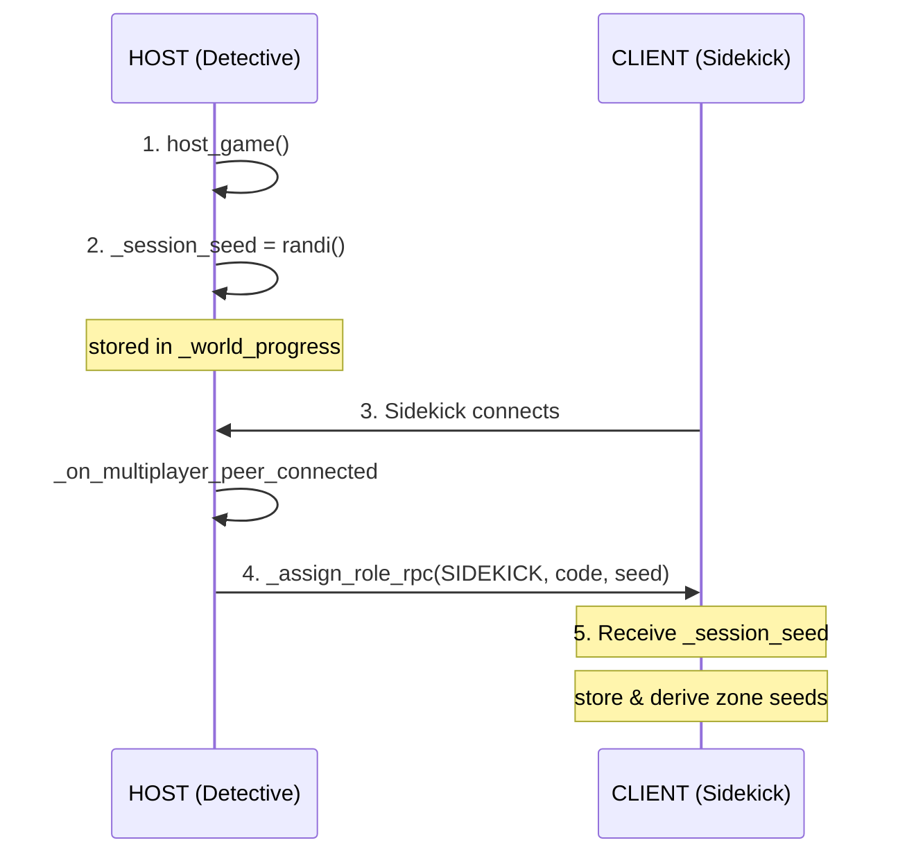
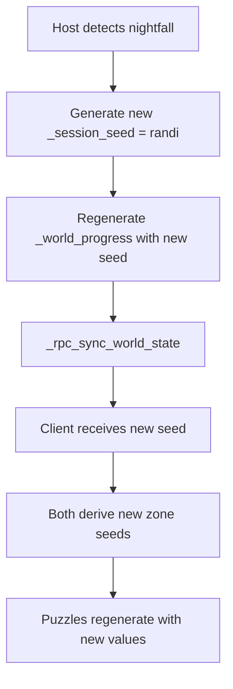

# Puzzle Randomization Engine Plan

## Overview
Implement a deterministic puzzle randomization system that generates identical puzzles for both players using a shared session seed.

---

## Phase 1: Seed Architecture Consolidation

### 1.1 Centralize Session Seed in NetworkManager
**Current:** `_session_seed` exists but zone-specific seeds in GameState are independently generated

**Changes:**
- Keep `_session_seed` as the master seed in NetworkManager
- Derive zone-specific seeds deterministically from session seed using hash function
- Remove independent seed generation from GameState

**Seed Derivation Formula:**
```gdscript
zone_seed = hash(session_seed + zone_id)
```

### 1.2 Seed Sync Flow


---

## Phase 2: GameState Integration

### 2.1 Remove Local Seed Generation
- Remove `_initialize_puzzle_seeds()` from `_ready()`
- Keep `puzzle_seeds` dictionary for caching

### 2.2 Add Seed Setter
Add function to receive and apply session seed from NetworkManager:
```gdscript
func set_session_seed(session_seed: int):
    # Derive zone seeds deterministically
    for zone in zones_status.keys():
        puzzle_seeds[zone] = hash(session_seed + zone)
```

### 2.3 Lazy Seed Initialization
Modify `get_puzzle_seed()` to handle uninitialized state gracefully

---

## Phase 3: PuzzleManager Fixes

### 3.1 Fix Seed Parameter Bug
**Issue:** Functions use `seed` instead of `_seed` parameter

**Fix:** Update all generator functions to use the correct parameter name:
- `_generate_algebra_puzzle()`
- `_generate_conversion_puzzle()`
- `_generate_coordinate_puzzle()`
- `_generate_volume_puzzle()`
- `_generate_arithmetic_puzzle()`

### 3.2 Update API
Change `get_puzzle_for_zone()` to use zone_id to fetch the correct seed from GameState:
```gdscript
func get_puzzle_for_zone(zone_id: String) -> Dictionary:
    var seed = GameState.get_puzzle_seed(zone_id)
    # ... rest of implementation
```

---

## Phase 4: Puzzle Script Updates

### 4.1 Update Existing Puzzle Scripts
Update zone-specific puzzle scripts to fetch dynamic puzzle data:

**pinashouse_puzzle.gd:**
- Replace hardcoded `host_view`, `sidekick_view`, `solution`
- Add `_ready()` function to fetch puzzle data from PuzzleManager
- Store dynamic values generated from seed

**Pattern for all puzzle scripts:**
```gdscript
func _ready():
    var puzzle_data = PuzzleManager.get_puzzle_for_zone("pinas_house")
    host_view = puzzle_data.host_view
    sidekick_view = puzzle_data.sidekick_view
    solution = puzzle_data.solution
```

### 4.2 Zones to Update
1. `pinashouse_puzzle.gd` → `pinas_house` zone
2. Create/Update for: `backyard_path`, `old_well`, `storage_hut`, `abandoned_house`

---

## Phase 5: Network Sync Points

### 5.1 World State Sync
Ensure seed is included in `_world_progress` during `start_game()`:
```gdscript
_world_progress = {
    "session_seed": _session_seed,
    # ... other data
}
```

### 5.2 RPC Sync
World state sync via `_rpc_sync_world_state()` already handles puzzle_seeds sync (line 558-560)

---

## Phase 6: Reset/Retry Handling

### 6.1 Bakunawa Nightfall Reset
When `reset_game_after_nightfall()` is called:
- Generate NEW session seed on host only
- Sync new seed to client
- Regenerate all puzzle variations

**Flow:**


---

## Phase 7: Save/Load Integration

### 7.1 Save Data
Session seed already included in save data via `_world_progress`

### 7.2 Load Data
When loading saved game:
- Restore `_session_seed` from save data
- Re-derive zone seeds
- Puzzles regenerate deterministically from loaded seed

---

## Appendix: Placeholder Math Puzzle Game

A simple math puzzle placeholder for testing the randomization engine before implementing full zone puzzles.

### Overview
A basic arithmetic puzzle where players must solve simple equations to unlock a test door. Perfect for validating seed sync works correctly.

### Puzzle: `math_placeholder_puzzle.gd`

```gdscript
extends Node

# Puzzle data - populated from PuzzleManager
var question: String = ""
var answer: int = 0
var choices: Array = []

func _ready():
    # Fetch puzzle from PuzzleManager with current zone seed
    var puzzle_data = PuzzleManager.get_puzzle_for_zone("math_placeholder")
    question = puzzle_data.question
    answer = puzzle_data.answer
    choices = puzzle_data.choices
    
    # Display to player
    display_puzzle()

func display_puzzle():
    # Show question and choices in UI
    pass

func check_answer(selected: int) -> bool:
    return selected == answer
```

### PuzzleManager Addition

Add to `PUZZLE_TEMPLATES`:
```gdscript
"math_placeholder": {
    "type": "arithmetic_simple",
    "description": "Simple math problem for testing",
    "generate": "_generate_math_placeholder"
}
```

Add generator function:
```gdscript
func _generate_math_placeholder(zone_id: String, _seed: int) -> Dictionary:
    var rng = RandomNumberGenerator.new()
    rng.seed = _seed
    
    # Generate simple math problem: A + B = ?
    var a = rng.randi_range(1, 20)
    var b = rng.randi_range(1, 20)
    var correct_answer = a + b
    
    # Generate 3 wrong answers
    var wrong_answers = []
    while wrong_answers.size() < 3:
        var offset = rng.randi_range(-5, 5)
        if offset == 0:
            offset = 1
        var wrong = correct_answer + offset
        if wrong > 0 and not wrong in wrong_answers and wrong != correct_answer:
            wrong_answers.append(wrong)
    
    # Combine and shuffle choices
    var all_choices = wrong_answers.duplicate()
    all_choices.append(correct_answer)
    all_choices.shuffle()
    
    return {
        "zone_id": zone_id,
        "type": "arithmetic_simple",
        "question": "What is %d + %d?" % [a, b],
        "answer": correct_answer,
        "choices": all_choices,
        "host_view": {"question": "%d + %d = ?" % [a, b]},
        "sidekick_view": {"hints": ["Add %d and %d" % [a, b]]}
    }
```

### Testing with Placeholder

```mermaid
flowchart LR
    subgraph Session["Game Session"]
        direction TB
        S1[Host Seed: 12345] --> S2[Zone: math_placeholder]
        S2 --> S3[Derived Seed: hash(12345 + zone)]
        S3 --> S4[Problem: 12 + 7 = ?]
    end
    
    subgraph Sync["Network Sync"]
        direction TB
        N1[Host sends seed 12345] --> N2[Client receives seed]
        N2 --> N3[Client derives same zone seed]
        N3 --> N4[Same problem: 12 + 7 = ?]
    end
    
    Session --> Sync
```

### Quick Validation Checklist

| Test | Expected Result |
|------|-----------------|
| Host & Client same seed | Both see "12 + 7 = 19" |
| New game session | Different numbers appear |
| Nightfall reset | New numbers, different from before |
| Save & Load | Same numbers after loading |
| Multiple zones | Each zone has different puzzle from same seed |

### Example Session Outputs

**Session A (Seed: 12345):**
- Zone A: 12 + 7 = 19
- Zone B: 5 + 8 = 13

**Session B (Seed: 67890):**
- Zone A: 3 + 15 = 18
- Zone B: 9 + 4 = 13

**Session A Reloaded (Seed: 12345):**
- Zone A: 12 + 7 = 19 (identical to first Session A)
- Zone B: 5 + 8 = 13 (identical to first Session A)

---

## Implementation Checklist

| Component | Task | Priority |
|-----------|------|----------|
| NetworkManager | Verify seed generation in `host_game()` | P0 |
| NetworkManager | Verify seed sync in `_assign_role_rpc()` | P0 |
| GameState | Remove `_initialize_puzzle_seeds()` from `_ready()` | P0 |
| GameState | Add `set_session_seed()` function | P0 |
| GameState | Modify `get_puzzle_seed()` to derive from session seed | P0 |
| PuzzleManager | Fix `_seed` parameter naming bug | P0 |
| PuzzleManager | Update `get_puzzle_for_zone()` to use GameState seeds | P0 |
| PuzzleManager | Add `math_placeholder` template | P1 |
| Puzzles | Create `math_placeholder_puzzle.gd` | P1 |
| Puzzles | Update `pinashouse_puzzle.gd` to use dynamic data | P1 |
| Puzzles | Create/update remaining zone puzzle scripts | P1 |
| NetworkManager | Handle seed regeneration on nightfall reset | P2 |
| Testing | Verify identical puzzles on both clients | P0 |

---

## Testing Verification Points

1. **Same Seed = Same Puzzles:** Both players see identical puzzle values
2. **Different Sessions = Different Puzzles:** New game = new randomization
3. **Nightfall Reset = New Puzzles:** After getting caught, puzzles change
4. **Save/Load Preserves:** Loading game restores same puzzle values
5. **Client Reconnect:** Rejoining gets current session seed from host

---

## Files to Modify

| File | Lines | Changes |
|------|-------|---------|
| `network_manager.gd` | 173, 179, 464, 518-520 | Verify seed flow |
| `game_state.gd` | 82-91, 172-173, 158-159 | Seed architecture |
| `puzzle_manager.gd` | 38-44, 47-201 | Fix bugs, update API |
| `puzzle_manager.gd` | PUZZLE_TEMPLATES | Add math_placeholder |
| `puzzles/math_placeholder_puzzle.gd` | New | Placeholder test puzzle |
| `puzzles/pinashouse_puzzle.gd` | All | Dynamic values |
| `puzzles/backyard_path_puzzle.gd` | New | Dynamic values |
| `puzzles/old_well_puzzle.gd` | New | Dynamic values |
| `puzzles/storage_hut_puzzle.gd` | New | Dynamic values |
| `puzzles/abandoned_house_puzzle.gd` | New | Dynamic values |

---

## Architecture Summary

This plan ensures deterministic, synchronized puzzle randomization while maintaining clean separation between:
- **NetworkManager**: Network authority, seed generation and sync
- **GameState**: Game state, seed derivation and caching
- **PuzzleManager**: Puzzle logic, generation from seeds
